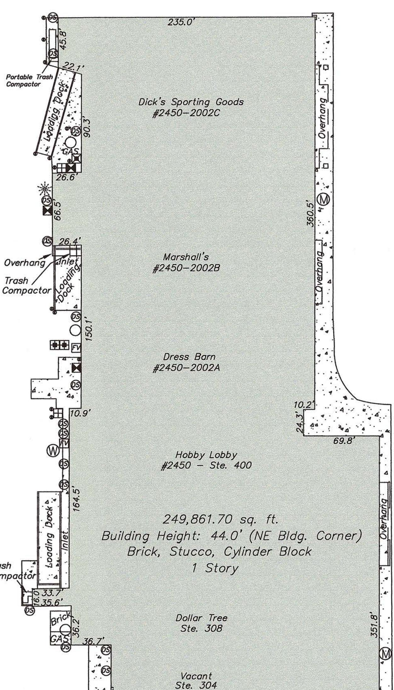
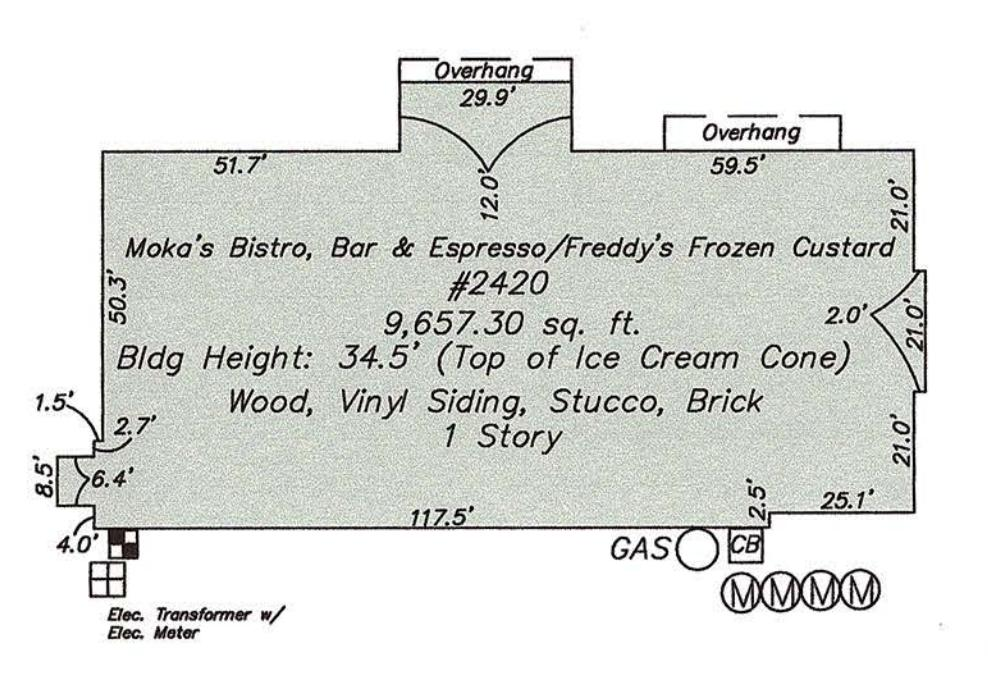
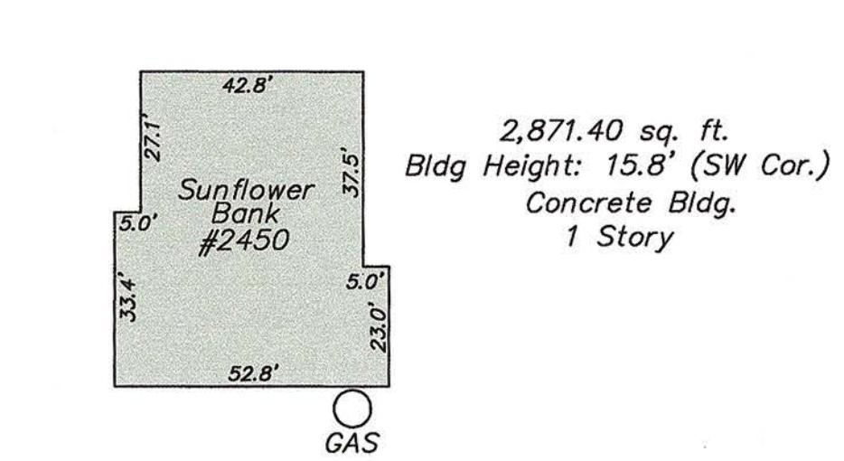
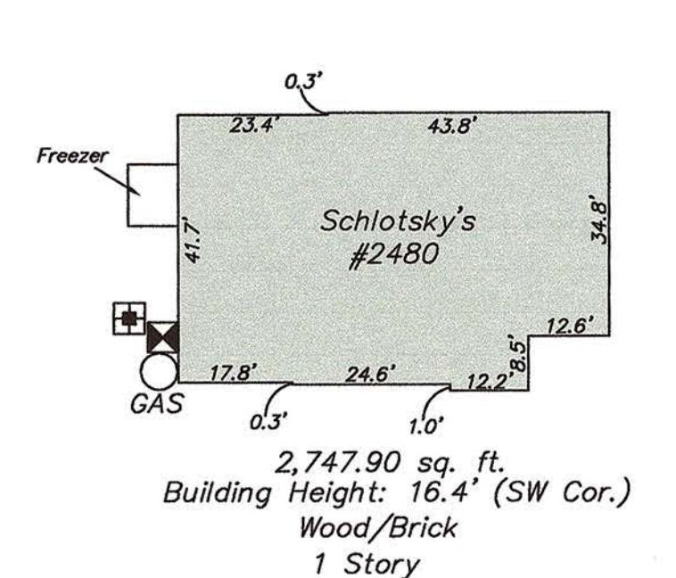
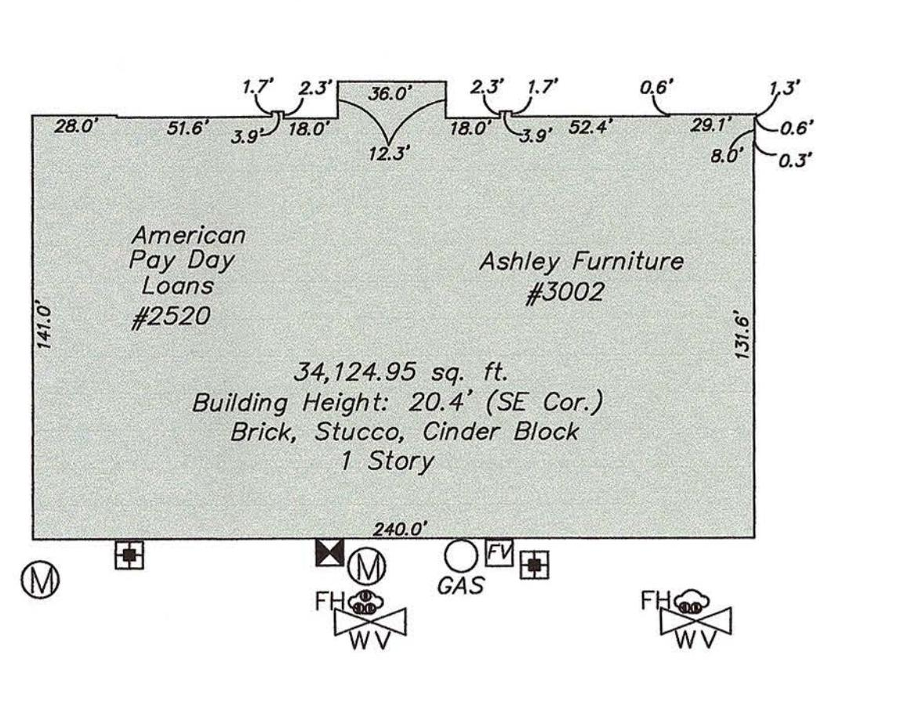
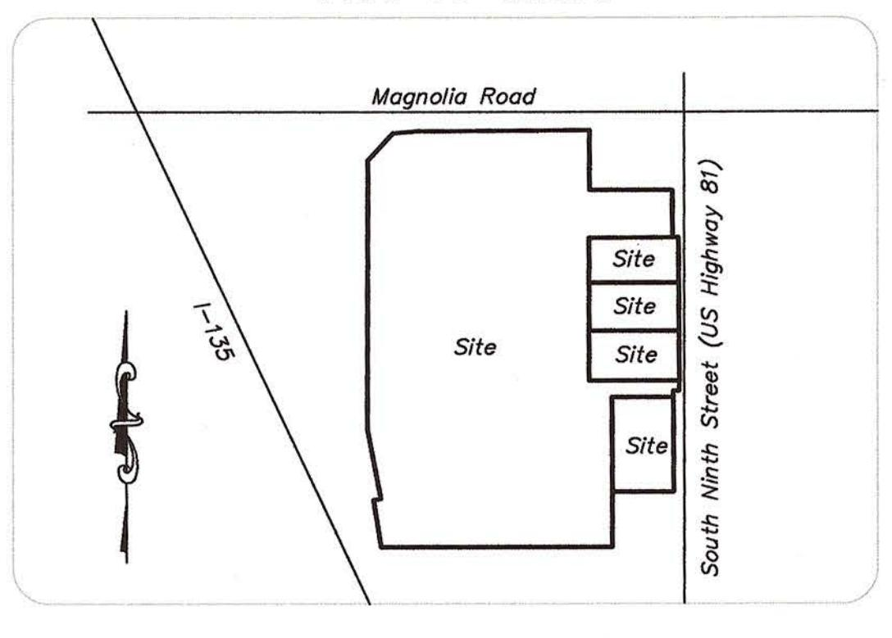
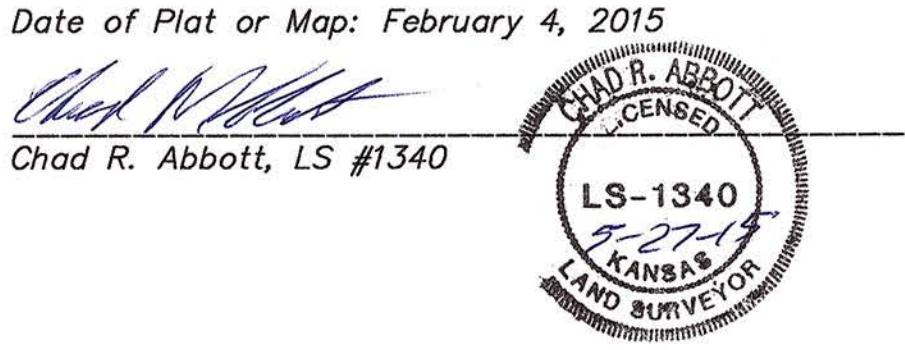
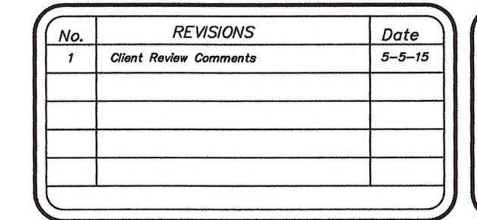
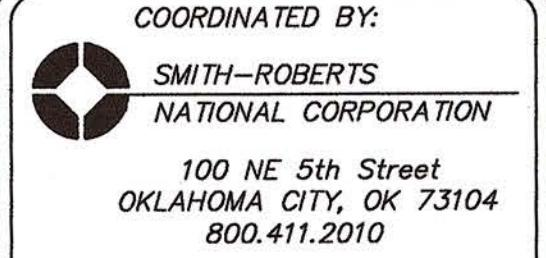
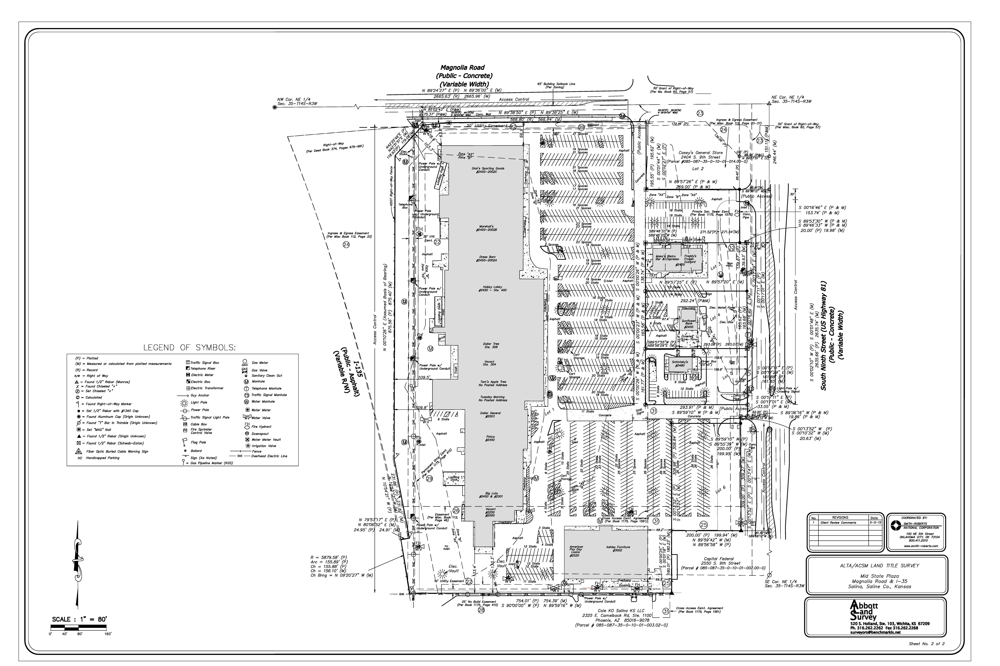

# SCHEDULE B-2 EASEMENT NOTES

Building setback lines, conditions, covenants, easements, reservations, and restrictions established by or shown on the plat of Midstate Plaza Addition

- recorded in Plat Book A-11 page 2, but deleting only covenants or restrictions based on race, color, religion, sex, sexual orientation, familial status, marital status, disability, handicap, national origin, ancestry, or source of income, as set forth in applicable state or federal laws, except to the extent said covenant or restriction is permitted by applicable law. Affects property and is shown hereon.
- Right of way granted to Kansas Power & Light Company recorded in Misc. Book 60 page 57. Affects property and is shown hereon.
- Agreement for Ingress and Egress Easement recorded in Misc. Book 112 page 33. Affects property and is shown hereon.
- Agreement between The Hanson Development Company and Capitol Federal Savings and Loan Association recorded in Misc. Book 112 page 42. Affects property, is shown hereon. Agreement appears to have expired with the paving of the parking lot.
- Easement granted to Capitol Federal Savings and Loan Association, recorded in Misc. Book 112 page 46. Affects property and is shown hereon.
- Operating and Reciprocal Easement Agreement recorded in Misc. Book 167 page 685. Affects property, is blanket in nature and is not shown hereon.
- No Build Easement recorded in Book 1175 page 410. Affects property and is shown hereon.
- Grant of permanent drainage easement to the City of Salina recorded in Book 1175 page 415. Affects property and is shown hereon.
- Cross access easement agreement recorded in Book 1175 page 1561; First Amendment to Reciprocal Easement Agreement records in Book 1220 page 1131. Affects property and is shown hereon.
- Grant of private sanitary sewer easement recorded in Book 1175 page 1575.

  Affects property and is shown hereon.

### GENERAL SURVEY NOTES:

- 1. The Basis of Bearings for this survey is N 00°10'26" E, being the West line of subject property.
- 2. This survey was made in accordance with laws and/or Minimum Standards of the State of Kansas.
- 3. The property described hereon is the same as the property described in Chicago Title Insurance Company NBU No.: 21403956 with an effective date of 12/31/2014 and that all easements, covenants and restrictions referenced in said title commitment or apparent from a physical inspection of the site or otherwise known to me have been plotted hereon or otherwise noted as to their effect on the subject property.
- 4. Said described property is located within an area having a Zone Designation "B" and "A5" by the Federal Emergency Management Agency (FEMA), on Flood Insurance Rate Map No. 200319 0015B, with a date of identification of 2/5/86, in Saline County, State of Kansas, which is the current Flood Insurance Rate Map for the community in which said premises is situated. Zone "B" denotes areas between limits of the 100-year flood and 500-year flood; or certain areas subject to 100-year flooding with average depths of less than 1 foot or where the contributing drainage area is less than 1 square mile; or areas protected by levees from the base flood. Zone "A5" denotes areas of 100-year flood; base flood elevations and flood hazard factors determined.
- 5. The Property has direct access to Magnolia Road & 9th Street, dedicated public streets or highways.
- 6. The total number of striped parking spaces on the subject property is 1180, including 60 designated handicap spaces.
- 7. There is no observed evidence of current earth moving work, building construction or building additions
- 8. There are no proposed changes in street right of way lines, according to the City of Salina. There is no observed evidence of recent street or sidewalk
- 9. There is no observed evidence of site use as a solid waste dump, sump or sanitary landfill
- 10. A portion of platted 20' Utility Easement crosses onto I-135 Highway as
- 11. There is a discrepancy between the plat control corners (found monuments in platted areas) and measured section line bearings. We previously contacted Schwab Eaton, the company that platted the property into MidState Plaza Addition, but were unable to reconcile the discrepancy.
- 12. A portion of the West and North edge of Moka's Bistro, Bar & Espresso's concrete crosses onto Lot 1.
- 13. The 75' Front Building Setback Line (Zoning) cannot be plotted without obtaining highway plans for S. 9th Street (US Hwy 81), however, the buildings do substantially exceed this requirement.
- 14. Utility Note: The underground utilities shown have been located from field survey information and existing drawings. The surveyor makes no guarantee that the underground utilities shown comprise all such utilities in the area, either in service or abandoned. The surveyor further does not warrant that the underground utilities shown are in the exact location indicated although he does certify that they are located as accurately as possible from information available. The surveyor has not physically located the underground utilities.

LIST OF POSSIBLE ENCROACHMENTS The following list of encroachments is only the opinion of this surveyor and should not be interpreted as complete listing.

No observable encroachments at time of survey

LAND AREA:

1,258,616.69 sq. ft. or 28.9 acres

## ZONING INFORMATION

Zoning Report provided by The Planning & Zoning Resource Corporation, PZR Site Number: 81748-1 dated 2/2/15.

Zoning District: C-3 Shopping Center

Front: 25' from property line; 55' from the centerline of a residential street; 65' from the centerline of a collector street; 75' from the centerline of an arterial

Side/Rear: None required, except when a side yard or rear yard abuts a residential district, then 15' shall

### Building Size-

Maximum Building Height or Stories: 35' Building Site Area Requirements: Minimum Lot Area-

Building Density Formula: Maximum Lot (Building) Coverage-40%

Parking Space Formula: Banks: 1 space for each 200 sq. ft. of floor area devoted to public banking services, plus 1 space for each 300 sq. ft. of floor area devoted to office use, plus 4 stacking spaces for each drive-up window (6,095 sq. ft. total per rent roll)(Estimated 50% devoted to public banking services and 50% devoted to office use)(Estimated 3 drive-up windows)

Restaurants: 1 space for each 50 sq. ft. of customer service or dining floor area or 1 space for each 3 persons based on the maximum occupancy at designated capacity; whichever is greater (16,822 sq. ft. per rent roll)(Estimated 70% devoted to customer service or dining floor area)

Furniture Store: 1 space for each 400 sq. ft. of floor area (32,579 sq. ft. total per rent roll) Retail: 1 space for each 250 sq. ft. of floor area (211,448 Sq. ft. total per rent roll)

Parking Spaces Required: (3,047.5/200)+(3,047.5/300)+(3x4)=25 (16,822×70%)/50=236 32,579/400=81 211,448/250=846 25+236+81+846=1,188 Total Spaces Required

Not To Scale

Tom's Apple Tree No Posted Address

Tuesday Morning

No Posted Address

Dollar General

#2003

Petco

#2450

Big Lots #2450 & #2001

Vacant

#2250 #2000

73.2'

93.4'

Ramp

ALTA/ACSM LAND TITLE SURVEY

Mid State Plaza Magnolia Road & 1-35 Salina, Saline Co., Kansas

Building Details Not to Scale

### VICINITY MAP Not to Scale

# SURVEYOR'S CERTIFICATE

To: Chase Shopping Centers, Inc., an Ohio corporation, RAF Salina LLC, an Ohio limited liability company, The Huntington National Bank, a national banking association, its successors and/or assigns, and Chicago Title Insurance Company:

This is to certify that this map or plat and the survey on which it is based were made in accordance with the 2011 Minimum Standard Detail Requirements for ALTA/ACSM Land Title Surveys, jointly established and adopted by ALTA and NSPS, and includes Items 1, 2, 3, 4, 6, 7a, 7b1, 7c, 8, 9, 10, 11a, 13, 14, 16, 17, 18, 19, and 21 of Table A thereof.

The field work was completed on January 26, 2015

# RECORD LEGAL DESCRIPTION (from commitment)

Lot 1, 3, 4, 5 and 6, MIDSTATE PLAZA ADDITION to the City of Salina, Saline County, Kansas.

Non-exclusive easement for access and parking as established by the Operating and Reciprocal Easement Agreement recorded in Misc. Book 167 page 685.

Non-exclusive easement for access as established by the Cross access easement agreement recorded in Book 1175 page 1561; First Amendment to Reciprocal Easement Agreement recorded in Book 1220 page 1131.

The above description describes the same property as described within Chicago Title Insurance Company, NBU No.: 21403956 & Local No.: L20147257, issued April 24, 2015 at 8:00 am.

www.smith-roberts.com

ALTA/ACSM LAND TITLE SURVEY

Mid State Plaza Magnolia Road & 1−35 Salina, Saline Co., Kansas

Abbott and Jurvey

520 S. Holland, Ste. 103, Wichita, KS 67209 Ph. 316.262.2262 Fax 316.262.2268 surveyors@benchmarkls.net

4294 16256 Mid State Plaza ALTA Survey Version 3s

Sheet No. 1 of 2

