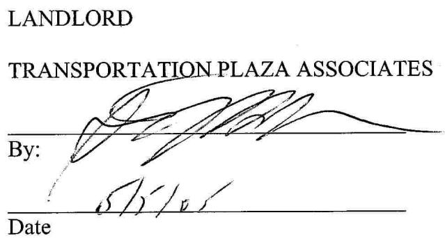

THISFIRSTAMENDMENTTOLEASE made this__dayof 2005,byandbetween TRANSPORTATIONPLAZAASSOCIATES,aConnecticutLimited Partnership(“Landlord"),andGMRI,INC.,f/k/a GENERALMILLSRESTAURANTS, INC.,aFlorida corporation("Tenant")；

# WITNESSETH

WHEREAS,Landlordand Tenant entered intoaLease onMarch23,1989("Lease") for premises situated at 4801 West $7 7 ^ { \mathrm { t h } }$ ,Burbank,Illinois(“Premises")and more particularly described in theLease;and

WHEREAS,Landlord and Tenantare desirous of extending the term of theLease and amending certain provisions therein.

NOWTHEREFORE,in consideration of the foregoingand the parties intending to be legally bound thereby,Landlordand Tenant herebyagreeas follows:

1. TheLease Termis hereby extended for an additional ten (10) years commencingFebruary1,2006and expiringonJanuary31,2016(‘Extended Term").Annual Rent and Monthly Rent during the Extended Term shall be as follows:

<table><tr><td>Term</td><td>AnnualRent</td><td>Monthly Rent</td></tr><tr><td>2/1/06-1/31/11</td><td>$84,000.00</td><td>$7,000.00</td></tr><tr><td>2/1/11-1/31/16</td><td>$92,400.00</td><td>$7,700.00</td></tr></table>

SuchAnnual and Monthly Rent shallbe inaddition to anyandall other rent (including,without limitation,PercentageRent) and charges,if applicable,due under the lease.

2. The options to renew set forth in Section 4.1B shall remain in effect;however, inparagraph2 thereof, the phase“includingthe rent due and payable pursuant toArticle 4.1A herein”is herebydeleted and the following shallbe inserted in lieu thereof:“except rent which shall be due and payable as follows:”

<table><tr><td>Term</td><td>AnnualRent</td><td>MonthlyRent</td></tr><tr><td></td><td></td><td></td></tr><tr><td>Option 1(2/1/16-1/31/21)</td><td>$101,640.00</td><td>$8,470.00</td></tr><tr><td>Option2(2/1/21-1/31/26)</td><td>$111,804.00</td><td>$9,317.00</td></tr></table>

3. Section 4.1A(ii) is hereby deleted in its entiretyand the following shall be inserted in lieu thereof:

“(ii)The amount by which $2 \%$ of Gross Sales (hereinafter defined) during eachLease Year or PartialLease Year exceeds the following breakpoints ("Percentage Rent"):   

<table><tr><td>Period</td><td>Breakpoint</td></tr><tr><td>2/1/06-1/31/11</td><td>$4,600,000.00</td></tr><tr><td>2/1/11-1/31/16</td><td>$5,020,000.00</td></tr><tr><td></td><td></td></tr><tr><td>Option 1 2/1/16-1/31/21</td><td>$5,482,000.00</td></tr><tr><td>Option 2</td><td></td></tr><tr><td>2/1/21-1/31/26</td><td>$5,990,200.00</td></tr></table>

4. The Tenantacknowledges that,asoftheEffectiveDate,theLandlord has performed its current obligationsunder theLease and is not in default under anyterm orprovisionof theLease.Inaddition,theTenant further acknowledges that no circumstances currently exist underwhich Landlord may bedeemed indefault,and Tenant hasno knowndefenses,set-offs,or counterclaimsto thepaymentofrent or other amount due from Tenant to Landlord under the Lease without the benefit of performing an audit.

5. Tenant represents and warrants to Landlord that Tenant has not dealt with any broker or brokers in connection with thisAmendment other thanMid-America AssetManagement,Inc.and Tenantherebyagrees to indemnifyand hold Landlord harmless fromandagainstanyandall losses,damages,liabilities, and expenses (including reasonable attorneys'fees)arising fromany claims of anyother broker or brokers or finders foranycommissionalleged to be due such other broker or brokers or finders in connectionwith this Amendment. Landlord represents and warrants to Tenant that it has not dealt with any brokerorbrokers otherthanMid-AmericaAssetManagement,Inc.in connection with this Amendment andLandlord herebyagrees to indemnifyand holdTenant harmless fromand againstany.andall losses,damages,liabilities, and expenses(including reasonable attorneys'fees) arising fromany claimsof anybroker or brokers or finders for anycommission alleged to be due such otherbroker or brokers or findersin connectionwith thisAmendment.

6. Authorization.The undersigned individual(s) executing this Amendment on behalf ofLandlord and Tenant do hereby representand warrant to each other that they are each fully empowered and authorized to execute this Amendment.

7. Full Force and Effect.Landlord and Tenant do hereby represent and warrant that theLeaseasamended hereby isin full forceand effect.

8. Conflict.To the extent the termsand provisions of thisAmendment conflict with the terms and provisions of the Lease and/or previous amendments thereto,the terms and provisions of this Amendment shall control.   
9. This Amendment may be executed in one or more counterparts,all of which together shall constitute one instrument.

INWITNESSWHEREOF,theparties have executed thisFirstAmendment toLease effective as of the datewrittenabove.

# TENANT

GMRI, INC.

By: Suk Singh SmS Sr.Vice President Ma2,200s Date