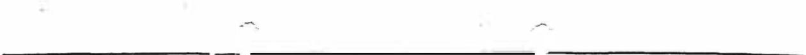
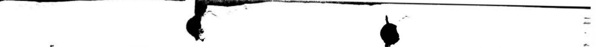

7305151

Prep. 1-12-89   
Rev. 3-14-89

BY AND BETWEEN

TRANSPORTATION PLAZA ASSOCIATES,

a Connecticut Limited Partnership

and

GENERAL MILLS RESTAURANTS， INC.,

a Florida Corporation

# BURBANK TOWN CENTER

# LEASE

THIS LEASE made this Zd day of Mavcl ，1989，by and between TRANSPORTATION PLAZA ASSOCIATES， a ConneCticut Limited Partnership，("Landlord")， and GENERAL MILLS RESTAURANTS， INC. a Florida Corporation ("Tenant");

WITNESSETH THAT， in consideration of the rents， covenants and agreements hereinafter set forth, such parties enter into the following agreement:

# ARTICLE I

# EXHIBITS

The exhibits listed below and attached to this Lease are incorporated herein by this reference:

<table><tr><td>EXHIBIT &quot;A&quot;</td><td></td><td>Legal description of real estate to be developed for a shopping center (hereinafter called &quot;Total Tract&quot;).</td></tr><tr><td>EXHIBIT &quot;B&quot;</td><td></td><td>Plot Plan of Total Tract, showing existing and proposed improvements and depicting Landlord&#x27;s Tract (hereinafter defined)， if different from the Center (Total Tract with existing and future improvements being hereinafter called the &quot;Center&quot;).</td></tr><tr><td>EXHIBIT &quot;C&quot;</td><td></td><td>Legal description of that part of the Total Tract owned or controlled or to be owned or controlled by Landlord (which， together，with all existing and future improvements thereon， is hereinafter called &quot;Landlord&#x27;s Tract&quot;). Landlord reserves unto itself the unlimited right to modify the configuration of Landlord&#x27;s Tract at any time for the purpose of incorporating additional department stores and other buiidings within the Center.</td></tr><tr><td>EXHIBIT &quot;D&quot;</td><td></td><td>Legal Description of the parcel of land herein demised to Tenant.</td></tr><tr><td>EXHIBIT &quot;E&quot;</td><td></td><td>Tenant&#x27;s Plans.</td></tr><tr><td>EXHIBIT &quot;F&quot;</td><td></td><td>Rules and Regulations.</td></tr></table>

Notwithstanding Exhibits A, B or C or anything else in this Lease contained， Landlord reserves the right to change or modify and add to or subtract from the size and dimensions of the Center or any part thereof， the number，location and dimensions of buildings and stores, the size and configuration of the parking areas， entrances， exits and parking aisle alignments, dimensions of hallways， malls and corridors, the number of floors in any building， the location, size and number of tenants' spaces and kiosks which may be erected， the identity， type and location of other stores and tenants， and the size， shape， location and arrangement of Common Areas (hereinafter defined)， and to design and decorate any portion of the Center as it desires， but the size and location of the land herein leased to Tenant and the access thereto from the adjacent public highway will not be changed except as a result of casualty， condemnation or other occurrence beyond Landlord's control.

# ARTICLE II LEASED PREMISES AND TERM

Section 2.1. Leased Premises.

Landlord hereby leases to Tenant and Tenant hereby rents from Landlord the land area designated as LL/Ol outlined in red on Exhibit "B" (hereinafter called "the Premises")， containing approximately .52 acres with a building on the Premises containing approximately 10,640 square feet (hereinafter called "Store Floor Area").

Section 2.2. Lease Term.

The term of this Lease (hereinafter called "Lease Term"） shall/ commence upon the date of the closing on the sale of the building on the Premises from Chi-Chi's of Illinois， Inc. to Tenant，as provided for in Section 3.2(&) below， the applicable date being hereinafter called "Commencement Date." The term of this Lease shall end on the last day of the sixteenth Lease Year (hereinafter defined) after the Commencement Date unless sooner terminated as herein provided.

# Section 2.3. Lease Year Defined.

"Lease Year," as used herein, means a period of 12 consecutive months during the Lease Term commencing on February 1st of any calendar year， the first Lease Year commencing on the first day of the first February following the Commencement Date. "Partial Lease Year" means that portion of the Lease Term prior to the first Lease Year.

# ARTICLE III TENANT'S WORK

# Section 3.1. Tenant's Work.

Tenant agrees to accept the Premises in its present "as is" condition.

Section 3.2. Conditions Precedent.

Anything contained in the Lease to the contrary notwithstanding, the following conditions precedent must be satisfied or waived by the Tenant by May 1，1989 (provided, however， that Landlord shall grant Tenant additional periods of time which are reasonably necessary to satisfy the conditions precedent so long as Tenant is diligently pursuing the satisfaction of all conditions precedent)，or Landlord shall have the right to cancel the Lease by written notice to Tenant. Any costs that are stated in this paragraph as being the Landlord's responsibility shall become due and payable only when the term of the Lease commences. In the event the term of the Lease does not commence, the Tenant shall bear all expenses. When the term of the Lease does commence， the Tenant shall advise the Landlord of the expenses that are the Landlord's responsibility and the Landlord shall pay same to Tenant upon receipt of a reasonably itemized statement and reasonably satisfactory evidence of prior payment thereof by Tenant. In the event such expenses are not paid within thirty (30) days from Landlord's receipt then Tenant will deduct same from rental payments until paid in full.

(1） Tenant's Plans. Within 30 days after the final execution of this Lease， Tenant will submit to Landlord to the attention of the Peripheral Property Department one (1） reproducible set (sephia） and 4 copies of plans and specifications， prepared by a registered architect, of all Tenant's Work to be done within the Premises together with renderings and exterior elevations of Tenant's building and a site plan showing the location of all of the improvements to be located within the Premises by Tenant (hereinafter called "Tenant's Plans").

Immediately thereafter, Landiord shall notify Tenant of any failures of Tenant's Plans to meet with Landlord's approval. Tenant shall within 15 days after receipt of any such notice cause Tenant's Plans to be revised to the extent necessary to obtain Landlord's approval and resubmitted for Landlord's approval. When Landlord has approved the original or revised Tenant's Plans， Landlord shall initial and return one (1） set of approved Tenant's Plans to Tenant and the same shall become a part hereof by this reference as Exhibit "E." Tenant shall not commence any of Tenant's Work until Landlord has approved Exhibit "E。"

(2） Zoning, Variance,Special Use Permits. The Demised Premises must be zoned to permit the Tenant's contemplated initial use at costs reasonably acceptable to Tenant. In the event the Demised Premises are not zoned to permit such use， or variance or special use permit is required, it will be the responsibility of the Tenant to obtain such rezoning， variance or special use permit. For purposes of this subparagraph， should there be a delay beyond the control of the parties in obtaining_permits for Tenant's contemplated use, then the period ending Mareh May1 1989for satisfaction or waiver of Conditions Precedent provided above shall be extended for the period of such delay.

(3) Title. Tenant may order at its expense a leasehold title insurance policy in the amount of \$525,oo0.0o from a national title insurance company acceptable to Tenant. Such title policy must reveal title to the land underlying any improvements on the Premises in Landlord and must be free from all standard ALTA exceptions， excluding the existing leasehold of Chi-Chi's of Illinois， Inc. In the event that the title insurance commitment or survey reveals defects or conditions that would render title uninsurable， unmarketable，or interfere with the Tenant's contemplated use, excluding Chi-Chi's of Illinois， Inc.'s leasehold, Tenant shall advice Landlord in writing and Landlord may elect but shall have no obligation to proceed diligently at its own expense to correct same within thirty (30) days from such notice， provided however，in no event shall Landlord be required to expend more than s3,ooo.0o to correct such defects or conditions.

(4) Permits. Tenant will attempt to obtain all necessary licenses, permits and other authorizations to utilize the Demised Premises for its initial contemplated use as stated herein as provided below. Such approval shall include, without limiting same， the right to erect signs of dimensions, style and location acceptable to Tenant, all building and construction permits and alcoholic beverage licenses and permits issued directly by appropriate government authority at the fees set by statute， ordinance or regulation. Landlord agrees to cooperate with Tenant and the state, or county municipal authorities to obtain such permits and will execute any documents necessary for Tenant's contemplated use. Immediately following approval of Tenant's Plans by Landlord, Tenant will apply for and proceed diligently， using its best efforts， to procure all 1icenses， permits and approvals necessary for the construction and operation by Tenant of a site down Italian restaurant serving liquor on the Premises. Tenant will notify Landlord in writing immediately upon Tenant's receipt of all such licenses, permits and approvals. "Permits" shall mean all of the governmental permits, licenses and authorizations required for the construction and continuous operation of the sit down Italian restaurant serving liquor upon the Premises，including， but not necessarily limited to， building permits, signage permits， site use approval， zoning certificates, environmental and land use permits，driveway， curb cut， approach road and access road approvals， water, sewer and utility certificates and any necessary approvals from state or local health, safety and transportation boards or authorities, and also including a liquor license issued by the State of Illinois or appropriate subdivision thereof, permitting Tenant to sell and serve alcoholic beverages for consumption upon the Premises in connection with its operations. conditioned upon the approval of same by the President of General of Tenant. In the eventysuchaproval or ratification isnot Obtained on or before forty-five(45) daye-after-the-last-signing-ef this-Lease, this Lease shall be null and void and of no further obligation owing to either party.

Landlord shall have the right to rely upon any transmittal to Landlord in furtherance of this paragraph executed by an officer of Tenant providing ratification and notice of approval.

(6） Non-Disturbance Agreement. In the event the title commitment reflects there is a mortgage， deed of trust or similar debt agreement in which the Demised Premises are the security， the Landlord shall make reasonable efforts to obtain a non-disturbance agreement in recordable form whereby the secured pary recognizes the lease and Tenant's rights hereunder in the event of foreclosure.

(7) Utilities. All utilities necessary for the Tenant's contemplated use including, without limiting same，electricity, water， sanitary and storm sewer and natural gas must be available for tap-in at or within the property line of the Demised Premises at costs reasonable acceptable to Tenant.

(8) Purchase of Building. This Lease is expressly conditioned upon the closing on the sale of the building on the Premises from Chi-Chi's of Illinois，Inc. to Tenant. Tenant hereby agrees that it will not close on the sale of the building until the foregoing Conditions Precedent in this Section 3.2 (1) - (7) are satisfied or waived. Tenant agrees to give Landlord written notice of the date on which the Conditions Precedent in Section 3.2 (1） - (7) are satisfied or waived and the date on which the closing on the sale of the building will occur.

Section 3.3. Completion of Tenant's Work.

Tenant shall commence Tenant's Work promptly following the Commencement Date， complete the same in strict accordance with Exhibit "E"，install all store and trade fixtures，equipment， stock in trade, merchandise and inventory， and open for business therein not later than 180 days thereafter，which 180th day shall be called the "Required Completion Date".

Section 3.3. Failure of Tenant to Perform.

Because of the difficulty or impossibility of determining Landlord's damages resulting from Tenant's failure to open for business fully fixtured， stocked and staffed on the Required Competion Date, including，but not limited to，damages from loss of percentage rent from other tenants，diminished saleability，leaseability, mortgageability or economic value of the Center or Landlord's Tract，if Tenant fails to commence Tenant's Work within the time provided above and proceed with the same diligently， or to open for business fully fixtured, stocked and staffed on or before the Required Completion Date or to perform any of its obligations to be performed prior to the Required Completion Date， Landlord may after notice， in addition to the right to exercise any other remedies and rights herein or at law provided: (a) do and perform any of Tenant's Work or other obligations of Tenant hereunder， at Tenant's expense， preparing such drawings and doing such things as Landlord deems advisable， collecting all of Landlord's expenses pursuant to this Section and (b)

either in lieu of， or at any time after proceeding as provided in sub-section (a） above， terminate this Lease，in which event Landlord shall have the right to recover，as damages and not as a penalty，a sum equal to the Minimum Annual Rent payable for one (1) Lease Year， plus all expenses incurred by Landlord pursuant to this Section， plus the cost of any alterations or repairs which Landlord in its sole discretion deems advisable to relet the Premises. All remedies in this Lease or at law provided shall be cumulative and not exclusive.

Section 3.4. Restrictions on Tenant's Work.

Tenant shall not make any modification to the existing building on the Premises which will increase its height beyond that which exists on the date of execution of this Lease. Tenant shall not erect any pylon sign on the Premises unless otherwise provided herein. When Tenant's Work is completed, there shall be a sufficient number of 9 foot wide parking spaces on the Premises to permit the parking of 5.5 cars for every 1,OoO square feet of space in Tenant's building.

Tenant shall not obstruct the sidewalks， walkways， parking areas, roadways and driveways located on or contiguous to the Premises， it being expressly understood that Landlord has reserved unto itself， its tenants and occupants of space within the Center and their customers, employees and invitees， the non-exclusive use for pedestrian and vehicular traffic of all such Common Areas (hereinafter defined) as may be located upon the Premises. Landlord and Tenant specifically covenant and agree that they will erect no barricades， fences or other barriers which would in any manner impede vehicular and pedestrian traffic on， across or over such Common Areas as the same may be constructed on the Premises or the Center.

# ARTICLE IV RENT

Section 4.1A. Minimum and Percentage Rent.

Tenant covenants and agrees to pay to Landlord, without notice or demand， at Landlord's address for notice (Landlord's and Tenant's notice addresses being the adresses specified in Section 24.7 hereof), as rent for the Premises:

(i） A Minimum Annual Rent of Seventy Five Thousand and O0/100 Dollars (s75,0oo.00) per annum，payable in equal monthly installments of Six Thousand Two Hundred Fifty and O0/100 Dollars (s6,250.00)，in advance upon the first day of each and every month commencing upon the Commencement Date and continuing thereafter through and including the last month of the sixteenth (16th) Lease Year of the Lease Term (such monthly instaliment being hereinafter called "minimum Monthly Rent"): and

(ii) The amount by which 2% of Gross Sales (hereinafter defined) during each Lease Year or Partial Lease Year exceeds the aggregate Minimum Monthly Rent for such period (hereinafter cailed "Percentage Rent").

Section 4.1B. Option to Renew.

Landlord hereby grants to Tenant the option to renew this Lease for two (2） additional terms of five (5) years each， which shall commence upon the expiration of the next preceding term. Such option, with respect to any renewal term, shall only be exercised by Tenant mailing to Landlord, at Landlord's Notice Address to the attention of the Peripheral Property Department，by United States mail， postage prepaid,certified or registered,return receipt requested, notice of the exercise of such option no earlier than 365 days and, not later than 180 days prior to the expiration of the then current term. No exercise of any option herein granted shall be effective if any default under or breach of this Lease (a) exists either at the time of exercise or on the expiration of the term during which it was exercised, or (b) occurs after the exercise and before the commencement of the renewal term.

In the event any such option is effectively exercised with respect to any renewal term， all terms and conditions of this Lease shall be applicable to such renewal term， including the rent due and payable pursuant to Article 4.1.A. herein.

Notwithstanding anything to the contrary in this Lease contained, the term "Lease Term" whenever used in this Lease， shall be defined to include the original term and all renewals and extensions thereof.

Section 4.2. Miscellaneous Rent Provisions.

Any rent or other amounts to be paid by Tenant which are not paid when due shall bear interest at the lesser of $10 \%$ per annum or the highest legal rate which Tenant may be required to pay in the State of Illinois. If the Commencement Date is other than the first day of a month， Tenant shall pay on the Commencement Date a prorated partial Minimum Monthly Rent for the period prior to the first day of the next calendar month， and thereafter Minimum Monthly Rent payments shall be made not later than the first day of each calendar month.

# Section 4.3. Percentage Rent.

Tenant shall (i） not later than the 20th day after the close of each calendar month，deliver to Landlord a written statement， showing Gross Sales made in such calendar month; and (i) not later than 6O days after the end of each Lease Year or Partial Lease Year,deliver to Landlord a statement of Gross Sales for such Lease Year or Partial Lease Year the correctness of which is certified to by an officer of Tenant. If Tenant fails to comply with the foregoing Landlord shall have the right to employ a certified public accountant to make such examination as is necessary to certify the amount of Tenant's Gross

Sales for any period for which Tenant's obligated tu retain records hereunder at Tenant's expense.

Within 6O days after the end of each Lease Year or Partial Lease Year， Tenant shall pay to Landlord for such Lease Year or Partial Lease Year Percentage Rent if Tenant is obligated to pay for such period.

Tenant will preserve for at least 3 years at Tenant's notice address all original books and records disclosing information pertaining to Gross Sales and such other information respecting Gross Sales as Landlord requires，including，but not limited to，cash register tapes，sales slips，sales checks， tax reports，bank deposit records， sales journals and other supporting data. Landlord and its agents shall have the right during business hours to examine and audit such books and records. If such examination or audit discloses a liability for Percentage Rent 3% or more in excess of the Percentage Rent paid by Tenant for any period or if Tenant's Gross Sales cannot be verified due to the insufficiency or inadequacy of Tenant's records, Tenant shall promptly pay Landlord the cost of said audit and the deficiency in rents， which deficiency shall be payable in any event, provided，however，Tenant，in good faith，shall have the right to contest such audit results.

# Section 4.4. Gross Sales Defined.

As used herein，Gross Sales means the sale prices of all goods, wares and merchandise sold and the charges for all services performed by Tenant or any other person or entity in，at，or from the Premises for cash，credit or otherwise，without reserve or deduction for uncollected amounts， including but not limited to sales and services (i) where the orders originate in，at or from the Premises，regardless from whence delivery or performance is made， (ii） pursuant to mail, telephone， telegraph or otherwise received or filled at the Premises， (iii） resulting from transactions originating in, at or from the Premises， and deposits not refunded to customers. Excluded from gross sales shall be: (i) exchanges of merchandise between Tenant's stores made only for the convenient operation of Tenant's business and not to consummate a sale made in，at or from the Premises，(ii） returns to manufacturers， (iii) refunds to customers (but only to the extent included in Gross Sales)，(iv) sales of fixtures, machinery and equipment after use in Tenant's business in the Premises，(v) sales or gross receipts tax， excise，value added or similar tax imposed by governmental authority and collected from customers and paid out by Tenant: (vi） revenue from the sales of trade fixtures: (vii） revenue from cigarette machines and pay telephones installed for the convenience of customers; (viii） insurance proceeds; (ix) bulk sales as defined by the UCC; $( \pmb { x } )$ ） sales to employees to the extent that they do not exceed $2 \%$ of Gross Sales; (xi) revenue from promotional sales which are defined as those sales of food and beverages at or near Tenant's cost， to the extent they do not exceed $1 \%$ of Gross Sales; and (xii) gift certificates until redeemed. No other taxes shall be deducted from Gross Sales.

Section 4.5. Real Estate Taxes.

A.  Tenant shall pay，during the Lease Term，all license fees and occupation taxes applicable to the business conducted by Tenant on the Premises， and all taxes on any and all personal property owned by Tenant and located upon the Premises.

B.Tenant shall pay all real property taxes levied upon the Premises and the buildings and other improvements on the Premises， but Tenant shall pay only such taxes as accrue after the Commencement Date of this Lease as provided for above，and it is the intent of the parties hereto that Tenant shall pay only such real property taxes as are applicable for the period covered by Tenant's term of possession.

C.Landlord agrees to request the County or Municipal Assessor to bill Tenant directly for such taxes，and if such bills are misdirected to Landlord, Landlord agrees to transmit the same to Tenant immediately upon receipt thereof. If Landlord is unable to arrange to have Tenant billed directly for such real property taxes，Landlord shall pay the same promptly when due and Tenant shall reimburse Landlord therefor upon receipt of Landlord's invoice.

D. If the County or Municipal Assessor fails or refuses to assess the land lying within the Premises as a separate tax lot， or if the assessment on the land 1ying within the Premises is not ascertainable from the Larger Tax Parcel (hereinafter defined) which includes the Premises，Landlord shall pay all real estate taxes assessed or imposed upon the Larger Tax Parcel which includes the Premises but excluding the improvements to the land and building(s) lying within the Premises ("Larger Tax Parcel") and Tenant shall pay to Landlord, as "Additional Rent" (as defined in Section 4.6 herein)，its proportionate share of all real estate taxes assessed or imposed upon the Larger Tax Parcel which become due or payable during the Lease Term， such proportionate share to be prorated for periods at the beginning and end of the Lease Term which do not constitute full calendar years，provided, however，it shall nonetheless pay all taxes, without apportionment， attributable to improvements to the land and buildings on the Premises.

Tenant's proportionate share of any such taxes assessed or imposed upon the Larger Tax Parcel shall be that portion thereof which bears the same ratio to the total of all taxes billed against the Larger Tax Parcel as the area of the Premises bears to the area of the Larger Tax Parcel. During each Lease Year of the Lease Term Tenant shall pay Landlord its proportionate share of such taxes in the same frequency in which Landlord is required to pay such taxes to the taxing authority.

E.Tenant shall also pay all other charges and levies, including but not limited to, special assessments of any kind or nature whatsoever which may be made or imposed upon the Premises and all the buildings and improvements hereafter to be placed thereon during the Lease Term or any renewal thereof by the County or Municipality， it being intended that this Lease shall be deemed and construed to be a "net， net Lease" and the Landlord shall receive all rent and Additional Rent to be paid by Tenant free of any charges， assessments， impositions expenses or deductions of every and any kind which might be imposed against the improvements and the land comprising the Premises. Notwithstanding the provisions of this Section 4.5.E.， Tenant also agrees to pay the 1988 real property tax installment on the Premises which is due and payable in September，1989.

F.Provided that Tenant receives a separate tax assessment， as aforesaid， Tenant shall have the right，at its expense， to contest in its own name any tax assessment imposed by taxing authorities by pursuing all lawful procedures available at law and shall be entitled to its proportionate share of any refund; HowEVeR， no such contest shall relieve Tenant of its obligations to make payments to Landlord when due hereunder. Tenant shall be entitled， upon request， to examine Landlord's records relating to real estate taxes， at Landlord's Notice Address，within three (3) years after the end of the tax year with respect to which such records are being examined. Landlord will execute and deliver such documents as may be required to effect such contest hereunder. In the event that such contest by Tenant results in a tax assessment for the Center higher than that in effect prior to such contest， Tenant shall pay to Landlord within 6O days after the end of each calendar year thereafter an amount equal to all such increases in taxes resulting from such increased assessment. If Tenant pays its proportionate share of real estate taxes， as aforesaid, Tenant shall have no right to contest Landlord's assessment.

# Section 4.6. Additional Rent.

All amounts required or provided to be paid by Tenant under this Lease other than Minimum Annual Rent and Percentage Rent shall be deemed additional rent for collection purposes and Minimum Annual Rent, Percentage Rent and additional rent shall in all events be deemed rent.

# Section 4.7. Payments for Tenant.

If Landlord pays any monies or incurs any expense to correct a breach of this Lease by Tenant or to do anything in this Lease required to be done by Tenant， all amounts so paid or incurred shall，on notice to Tenant， be considered additional rent payable by Tenant with the

first Minimum Monthly Rent installment thereafter becoming due and payable， and may be collected as by law provided in the case of rent.

ARTICLE VPARKING AND COMMON AREAS AND FACILITIES

# Section 5.1 Common Areas.

All parking areas，access roads and facilities furnished,made available or maintained by Landlord in or near the Center， including employee parking areas， truck ways， driveways， loading docks and areas, delivery areas, multi-story parking facilities (if any)， package pickup stations， elevators，escalators， pedestrain sidewalks， malls， including the Enclosed Mall (as indicated for identification purposes on Exhibit "B")，courts and ramps， landscaped areas， retaining walls， stairways, bus stops, first-aid and comfort stations,lighting facilities, sanitary systems，utility lines， water filtration and treatment facilities and other areas and improvements provided by Landlord for the general use in common of tenants and their customers and department stores in the Center (all herein called "Common Areas"） shall at all times be subject to the exclusive control and management of Landlord, and Landlord shall have the right， from time to time， to establish, modify and enforce reasonable rules and regulations with respect to all Common Areas. Tenant agrees to comply with all rules and regulations set forth in Exhibit "F" attached hereto and all reasonable amendments thereto， provided same take Tenant's business operation into account.

Landlord shall have the right from time to time to: change or modify and add to or subtract from the sizes，locations， shapes and arrangements of parking areas，entrances，exits， parking aisle alignments and other Common Areas， provided， however， that the size of parking areas on Landlord's Tract shall not be substantially reduced; restrict parking by Tenant's employees to designated areas; construct surface， sub-surface or elevated parking areas and facilities; establish and from time to time change the level or grade of parking surfaces; enforce parking charges (by meters or otherwise) with appropriate provisions for ticket validating: add to or subtract from the buildings in the Center; and do and perform such other acts in and to said Common Areas as Landlord in its sole discretion， reasonably applied,deems advisable for the use thereof by tenants and their customers. Any employee parking shall be reasonably proximate to the Premises and Tenant's closing employees shall not be subject to any regulations with respect thereto.

# Section 5.2 Use of Common Areas.

Tenant and its business invitees， employees and customers shall have the nonexclusive right， in common with Landlord and all others to whom Landlord has granted or may hereafter grant rights, to use the

Common Areas subject to such reasonable regulations as Landlord may from time to time impose and the rights of Landlord set forth above. Landlord may cause any car to be towed from the Center if， in its judgment， it is parked outside a designated parking area therefore. Tenant shall abide by all applicable rules and regulations and cause its concessionaires，officers and employees， agents， customers and invitees to abide thereby. Landlord may at any time close temporarily any Common Areas to make repairs or changes， prevent the acquisition of public rights therein， discourage noncustomer parking，or for other reasonable purposes. Tenant shall not interfere with Landlord's or others tenants' rights to use any part of the Common Areas.

ARTICLE VI COST AND MAINTENANCE OF COMMON AREAS

Section 6.1. Expense of Operating and Maintaining the Common Facilities.

Landlord will operate， manage， maintain and repair or cause to be operated， managed， maintained or repaired， the exterior Common Areas of the Center， to the extent the same is not done by any Department Store. "Landlord's Common Area Costs" shall mean all costs of operating and maintaining the exterior Common Areas in a manner deemed by Landlord appropriate for the best interests of tenants and other occupants in the Center， less contributions，if any， to Landlord's Common Area Costs received by Landlord from Department Stores in the Center. Included among the costs and expenses which constitute Landlord's Common Area Costs，but not limited thereto， shall be,at the option of Landlord, all costs and expenses of protecting， operating， managing， repairing, repaving，1ighting， cleaning， painting, striping, insuring (including but not limited to fire and extended coverage insurance for Common Areas， insurance protecting Landlord against liability for personal injury， death and property damage and workers compensation insurance), removing of snow, ice and debris， police protection， security and security patrol， fire protection, regulating traffic, inspecting, repairing and maintaining of machinery and equipment used in the operation of the exterior Common Areas, depreciation of such machinery and equipment， cost and expense of inspecting， maintaining， repairing and replacing storm and sanitary drainage systems, electrical， gas, water and irrigation systems， cost and expense of maintaining and repairing the exterior of the buildings on Landlord's Tract， including, but not limited to roofs, skylights,walls， stairs and signs， cost and expense of 1andscaping and shrubbery， expense of utilities， and administrative and overhead costs equal to $15 \%$ of all of the foregoing and all other of Landlord's Common Area Costs.

Section 6.2. Tenant's Share of Landlord's Common Area Expenses.

Tenant will pay Landlord as Tenant's share of Landlord's Common Area Costs， in addition to all other amounts provided in this Lease a flat rate of One Hundred Fifty and O0/100 Dollars (s150.00) per Month with such payment being due the first day of each Month of each Lease Year，in advance. The flat rate due hereunder shall be increased by $15 \%$ at the end of every 5th Lease Year until the expiration of the Lease and any renewal terms thereof.

Section 7.1. Utilities.

Tenant shall be solely responsible for and promptly pay all charges for use or consumption of sewer， gas， electricity, water and all other utility services on the Premises.

Section 8.1. Use of Premises.

The Premises shall be occupied and used by Tenant solely for the purpose of conducting therein the business of a sit down Italian restaurant serving alcoholic beverages and for no other use or purpose. Any change in the Tenant's menu from Italian to other types of cuisine must be approved in writing by Landlord, provided however， Tenant may include non-Italian menu items so long as its identity and a substantial majority of its menu items remain Italian in nature. Tenant may change its use to any then existing restaurant business only with Landlord's prior written approval which shall not be unreasonably withheld. SIC Code: 302.

# Section 8.2. Prompt Occupancy and Use.

Tenant will occupy the Premises upon the Commencement Date and thereafter continuously operate and conduct in $100 \%$ of the Premises during each hour of the entire Lease Term when Tenant is required under this Lease to be open for business the business permitted under Section 8.1 hereof，with a full staff and full stock of merchandise, using only such minor portions of the Premises for storage and office purposes as are reasonably required. The parties agree that: Landlord has relied upon Tenant's occupancy and operation in accordance with the foregoing provisions; because of the difficulty or impossibility of determining Landlord's damages which would result from Tenant's violation of such provisions, including but not limited to damages from loss of Percentage Rent from Tenant and other tenants， and diminished saleability， mortgageability and economic value，Landlord shall be entitled to damages if it elects to pursue such remedy: therefore for any day that Tenant does not fully comply with the provisions of this

Section 8.2 the Minimum Annual Rent， prorated on a daily basis， shall be increased by $50 \%$ ， such increased sum representing the damages which the parties agree Landlord will suffer by Tenant's noncompliance. In addition to all other remedies，Landlord shall have the right to obtain specific performance by Tenant upon Tenant's failure to comply with the provisions of this Section 8.2.

# Section 8.3. Conduct of Business.

Such business shall be conducted (a） under the name THE OLIVE GARDEN or Tenant's trade name then applicable on a regional or national basis， provided Tenant gives Landlord prior written notice，but any other name must previously be approved in writing by the Landlord; and (b)in such manner as shall assure the transaction of a maximum volume of business in and at the Premises. Tenant shall be and remain open from 11:00 A.M. until 10:0O P.M. each day of the week except Sunday, and in addition， during such other days, nights and hours as Tenant shall decide，in the exercise of good business judgment， to be appropriate.

# Section 8.4. Operation by Tenant.

Tenant covenants and agrees that it will: not place or maintain any merchandise， vending machines or other articles outside the building on the Premises; store garbage， trash, rubbish and other refuse in rat-proof and insect-proof containers with adequate screening to hide such garbage， trash， rubbish and refuse from view on the Premises, and remove the same frequently and regularly， with adequate screening to hide such garbage， trash， rubbish and refuse from view, all at Tenant's cost; not permit any sound system，other than its customer call system, audible or objectionable advertising medium visible outside the building on the Premises; not commit or permit waste or a nuisance upon the Premises; not permit or cause odors to emanate or be dispelled from the building on the Premises other than normal cooking odors; not solicit business in the Common Areas nor distribute advertising matter to， in or upon any Common Areas; not permit the loading or unloading or the parking or standing of delivery vehicles outside any area designated therefor， nor permit any use of vehicles which will interfere with the use of any Common Areas: comply with all applicable laws， recommendations， ordinances， rules and regulations of governmental， public, private and other authorities and agencies, including those with legally enforceable authority over insurance rates， with respect to the use or occupancy of the Premises, and including but not limited to the Williams-Steiger Occupational Safety and Health Act.

# Section 8.5. Storage.

Tenant shall store in the building on the Premises only merchandise and products which Tenant intends to sell at, in or from the Premises， within a reasonable time after receipt thereof.

Section 8.6. Painting,Decorating，Displays,Alterations.

Tenant will not paint，decorate or change the architectural treatment of any part of the exterior of the building on the Premises nor make any structural alterations， additions or changes in the Premises without Landlord's written approval thereto， which approval shall not be unreasonable withheld, and will promptly remove any paint, decoration，alteration，addition or changes applied or installed without Landlord's approval and restore the Premises to an acceptable condition or take such other action with respect thereto as Landlord directs.

# Section 8.7. Other Operations.

a) If during the Lease Term Tenant directly or indirectly operates, manages or has any interest whatsoever in any other store or business operated under the same trade name for a purpose or business similar to or in competition with all or part of the business permitted under Section 8.1 hereof within a radius of 2 miles of the Center，it will injure Landlord's ability and right to receive Percentage Rent (such ability and right being a major consideration for this Lease and the construction of the Center). Accordingly， if Tenant operates, manages or has such interest in any such store or business within such radius, $50 \%$ of all sales made from any such other store or business shall be included in the computation of Gross Sales for the purpose of determining Percentage Rent under this Lease as though said Gross Sales had actually been made at， in or from the Premises. Landlord shall have all rights of inspection of books and records with respect to such stores or businesses as it has with respect to the Premises; and Tenant shall furnish to Landlord such reports with respect to Gross Sales from such other store or business as it is herein required to furnish with respect to the Premises.

b) Restrictive Covenant. Landlord agrees that for a period of sixteen years from the commencement of the Term hereof，or until any change in use pursuant to this Lease, whichever shall first occur, Landlord will not lease, sublease or otherwise operate or contract， by conveyance or otherwise， in the Center， for a food service establishment featuring or specializing in the sale,at retail，of Italian food in a manner similar to Tenant. Featuring or specializing, for the purposes of this provision, shall mean that such items as aforedescribed, shall be identified as major menu items in terms of sales volume of public identification. The aforesaid restriction shall not be applicable to any food service establishment, to any purveyor of unprepared foods intended for future off-premises consumption and shall not be applicable to any in-lying tenants of the Center.

Landlord and Tenant agree that the covenant herein contained shall be deemed to run with the land and may be recorded in furtherance thereof. This covenant may not be waived without Tenant's express written consent. Anything in this Lease to the contrary notwithstanding， Tenant may enforce this covenant by injunctive relief, and，in addition， may seek damages,at law or in equity， arising from violation thereof.

# Section 8.8. Sales and Dignified Use.

No public or private auction or any fire， "going out of business," bankruptcy or similar sales or auctions shall be conducted in or from the Premises and the Premises shall not be used except in a dignified and ethical manner consistent with the general high standards of merchandising in the Center and not in a disreputable or immoral manner or in violation of national， state or local laws.

# ARTICLE IX MAINTENANCE OF LEASED PREMISES

# Section 9.1. Maintenance by Tenant.

Tenant shall at all times keep the Premises (including all of the improvements thereon） and all parts of the Premises and parts of Tenant's Work on the Premises in good order， condition and repair and clean， orderly， sanitary and safe, damage by unavoidable casualty excepted, (including but not 1imited to doing such things as are necessary to cause the Premises to comply with applicable laws, ordinances， rules， regulations and orders of governmental and public bodies and agencies， such as but not limited to the Williams-Steiger Occupational Safety and Health Act). If replacement of equipment, fixtures and appurtenances thereto is necessary, Tenant shall replace the same with new or completely reconditioned equipment， fixtures and appurtenances， and repair all damages done in or by such replacement. If Tenant fails to perform its obligations hereunder， Landlord after notice and failure to cure may, but shall not be obligated to, perform Tenant's obligations or perform work resulting from Tenant's acts, actions or omissions and add the cost of the same to the next installment of Minimum Monthly Rent due hereunder. Unless Tenant is exercising due diligence， if Tenant fails to perform its obligations hereunder， within 5 business days after receiving written notice from Landlord，Landlord, may， but shall not be obligated to，perform Tenant's obligations or perform work the next installment of Minimum Monthly Rent due hereunder. Landlord reserves the right to enter Tenant's Premises in case of emergency without giving Tenant prior notice for purposes of this Section.

Section 9.2. Surrender of Premises.

At the expiration of the Lease Term， Tenant shall surrender the Premises in the same condition as they were required to be in on the Required Completion Date， reasonable wear and tear and damage by unavoidable casualty excepted, and deliver all keys for，and all combinations on locks， safes and vaults in， the Premises to Landlord at Landlord's notice address as specified in Section 24.7 or， at Landlord's option， to the office of the Center's general manager.

ARTICLE X SIGNS，AWNINGS，CANOPIES，FIXTURES，ALTERATIONS

Section 10.1. Fixtures.

All fixtures installed by Tenant shall be new or completely reconditioned.

Section 10.2. Removal and Restoration by Tenant.

All alterations,changes and additions and all improvements, including leasehold improvements, made by Tenant，or made by Landlord on Tenant's behalf, whether part of Tenant's Work or not and whether or not paid for wholly or in part by Landlord, shall remain Tenant's property for the Lease Term. Any alterations， changes， additions and improvements shall immediately upon the termination of this Lease become Landlord's property，be considered part of the Premises，and not be removed at or prior to the end of the Lease Term without Landlord's written consent. If Tenant fails to remove any shelving， decorations, equipment， trade fixtures or personal property from the Premises prior to the end of the Lease Term， they shall become Landlord's property and Tenant shall repair or pay for the repair of any damage done to the Premises resulting from removing same.

Section 10.3. Tenant's Liens.

A.Tenant shall not suffer any mechanics' or materialmen's lien to be filed against the Premises or the Center by reason of work, labor， services or materials performed or furnished to Tenant or anyone holding any part of the Premises under Tenant. If any such lien shall at any time be filed as aforesaid, Tenant may contest the same in good faith，but，notwithstanding such contest，Tenant shall，within 15 days after the filing thereof，cause such lien to be released of record by payment，bond,order of a court of competent jurisdiction，or otherwise. In the event of Tenant's failure to release of record any such lien within the aforesaid period, Landlord may remove said lien by paying the full amount thereof or by bonding or in any other manner Landlord deems appropriate, without investigating the validity thereof, and irrespective of the fact that Tenant may contest the propriety or the amount thereof， and Tenant，upon demand， shall pay Landlord the amount so paid out by Landlord in connection with the discharge of said lien， together with reasonable expenses incurred in connection therewith， including reasonable attorneys' fees. Nothing contained in this Lease shall be construed as a consent on the part of Landlord to subject Landlord's estate in the Premises to any lien or liability under the lien laws of the State of Illinois.

B. Mortgaging of Leasehold Estate. Tenant is hereby given the right by Landlord to mortgage its interest in this Lease, or any part of parts thereof， under no more than one leasehold mortgage ("Mortgage")， and assign this Lease as security for such Mortgage upon the condition that all rights acquired under such Mortgage shall be subject to each and every covenant， condition， and restriction set forth in this Lease， and to all rights and interests of Landlord herein. This Leasehold Mortgage permiteed herein shall not exceed $80 \%$ of the fair market value of the Premises and the attendant improvements thereon，and shall not bear interest at a rate in excess of Twelve percent $( 1 2 \%$ ) per annum. In addition， such leasehold Mortgage shall be amortized and retired over a term not exceeding the primary term of this Lease in level payments or principal and interest. If Tenant shall Mortgage this leasehold, or any part or parts thereof， and if the holder ("Mortgagee"） of any such Mortgage shall send to Landlord a true copy thereof， together with written notice specifying the name and address of the Mortgagee and the pertinent recording date with respect to any such Mortgage, then the Landlord agrees that so long as any such Mortgage shall remain unsatisfied of record or until written notice of satisfaction is given by the holder of such Mortgage to Landlord， the following provisions shall apply:

(a) Landlord shall，upon serving Tenant with any notice of default， simultaneously serve a copy of such notice upon the Mortgagee. The Mortgagee shall thereupon have the same period after service of such notice upon it， to remedy or cause to be remedied the defaults complained of，and Landlord shall accept such performance by or at the instigation of such Mortgagee as if the same had been done by Tenant.

(b) Anything herein contained notwithstanding while such leasehold Mortgage remains unsatisfied of record, or until Landlord receives written notice from Mortgagee that such mortgage has been satisfied, if any default shall occur which, pursuant to any provision of this Lease, entitles Landlord to terminate this Lease and if before the expiration of five (5) days from the date of service of notice of termination upon such Mortgagee， Mortgagee shall have notified Landlord of its desire to nullify such notice and shall have paid to Landlord all rent and additional rent and other payments herein provided for and then in default，and shall have cured any other outstanding defaults and shall have otherwise complied with all of the requirements of this Lease，if any are then in default， then in such event Landlord shall

not be entitled to termiuate this Lease and any notice of termination theretofore given shall be void and of no effect.

(c) Landlord agrees that the name of the Mortgagee may be added to the "Loss Payable Endorsement" of any and all insurance policies required to be carried by Tenant hereunder on condition that insurance proceeds are to be applied in the manner specified in this Lease and that the Mortgage or collateral document shall so provide.

(d) Landlord agrees that in the event of termination of this Lease by reason of any default by Tenant other than for nonpayment of rent or additional rent and other payments herein provided for， that Landlord will enter into a new Lease of the Premises with appurtenant easement rights and non-disturbance agreements with the Mortgagee or its nominee (acceptable to Landlord） for the remainder of the primary term hereof,effective as of the date of such termination, at the rent and additional rent and upon the terms， provisions， covenants and agreements as herein contained and otherwise in the same form as this Lease，provided:

(1) Said Mortgagee or its nominee shall make written request upon Landlord for such new Lease at least ten (1O) days prior to the date of such termination and such written request is accompanied by payment of Landlord of sums then due to Landlord under this Lease;

(2) Said Mortgagee or its nominee shall pay to Landlord at the time of the execution and delivery of said new Lease， any and all sums owed by Tenant;

(3) Said Mortgagee or its nominee shall perform and observe all covenants herein contained on Tenant's part to be performed and shall further remedy any other conditions which Tenant under the terminated Lease was obligated to perform under the terms of this Lease， including those with respect to use， trade name and the 1ike; and

(4) The Tenant under such new Lease shall have the same right, title and interest in and to the buildings and improvements on the Premises as Tenant had under the terminated Lease.

(e) The proceeds from any insurance policies or arising from a condemnation are to be held by Mortgagee and distributed pursuant to the provisions of this Lease.

(f) The term "Mortgage"，whenever used herein， shall include whatever security instruments are used in the locale of the Premises, such as without 1imitation，deeds of trust， security deeds and conditional deeds， as well as financial statements， security agreements and other documentation required pursuant to the Uniform Commercial Code. The term "Mortgagee"， whenever used herein, shall also include any instruments required in connection with a sale-leaseback transaction.

(g) Nothing herein shall be construed as limiting Tenant's right to finance and/or refinance Tenant's trade fixtures, inventory and/or equipment.

Section 1O.4.signs,Awnings and Canopies.

Other than those allowed herein， Tenant will not place or permit on any exterior door or window or any wall of the building on the Premises or elsewhere on the Premises，any sign， awning，canopy, advertising matter， decoration, lettering or other thing of any kind which has not been approved in writing by Landlord.

Section 1O.5. Pylon and Building Facia Signs.

Tenant may erect one pylon sign on the Premises provided that: 1) the height of such pylon sign does not exceed eighteen feet; 2） the area of each side does not exceed 10o square feet; 3） the pylon sign is erected in the area located directly in front of Tenant's building; and 4） such sign does not materially obstruct the visibility of the Shopping Center or any other signs identifying the Shopping Center or other tenants.

Tenant may also install on the front facia of its building，a building facia sign， the length not exceeding $50 \%$ of the facia on which it is installed and its letters being box-backed or individually lit and not exceeding 3O inches in height.

Notwithstanding anything to the contrary above， Landlord reserves the right to approve the content， design and location of any pylon or building facia sign prior to its installation.

# ARTICLE XI INSURANCE

Section 11.1. By Landlord.

Landlord shall carry public liability insurance on those portions of the Common Areas included in Landlord's Tract providing coverage of not less than S3,ooo,0o0.00 against liability for bodily injury including death and personal injury for any one (1） occurrence and \$1,000,ooo.0o property damage insurance，or combined single limit insurance in the amount of s3,ooo,oo0.00.

Section 11.2. By Tenant.

Tenant agrees to carry public liability insurance on the Premises during the Lease Term， covering the Tenant and naming the Landlord as an additional named insured with terms and companies satisfactory to Landlord, for limits of not less than s3,000,0o0.00 for bodily injury. including death， and personal injury for any one (1） occurrence, \$1,000,oOoo.00 property damage insurance or a combined single limit of \$3,000,ooo.0o. Tenant's insurance will include contractual liability coverage recognizing this Lease， products and/or completed operations liability and providing that Landlord and Tenant shall be given a minimum of 15 days written notice by the insurance company prior to cancellation, termination or change in such insurance. Tenant also agrees to carry insurance against fire and such other risks as are from time to time included in standard Fire and Extended Coverage insurance, for the full insurable value, covering all of Tenant's Work on the Premises and all items of personal property of Tenant located on or within the Premises. Tenant shall provide Landlord with certificates or，at Landlord's request， copies of the policies, evidencing that such insurance is in full force and effect and stating the terms thereof. The minimum limits of the comprehensive general liability policy of insurance shall in no way limit or diminish Tenant's liability under Section 11.6 hereof. Tenant shall have the right to self insure for its personal property hereunder and may utilize blanket coverage.

Prior to commencement of Tenant's Work and until completion thereof，or commencement of the Lease Term， whichever is the last to occur， Tenant shall effect and maintain Builder's Risk Insurance covering Landlord, Tenant， Tenant's contractors and Tenant's subcontractors，as their interest may appear， against loss or damage by fire,vandalism and malicious mischief and such other risks as are customarily covered by a so-called "extended coverage endorsement" of Tenant's Work，and all materials， equipment， supplies and temporary structures of all kinds incidental to Tenant's Work and equipment， all while forming a part of or contained in such improvements or temporary structures, or while on the Premises or within 10O feet thereof，or when adjacent thereto,while on sidewalks， streets or alleys，all to the full insurable value thereof at all times on a completed value basis. Subject to Section 11.4 herein, in addition, Tenant agrees to indemnify and hold Landlord harmless against any and all claims for injury to persons or damage to property by reason of the use of the Premises for the performance of Tenant's Work， and claims， fines， and penalties arising out of any failure of Tenant or its agents, contractors and employees to comply with any law, ordinance， code requirement， regulations or other requirement applicable to Tenant's Work and Tenant agrees to require all contractors and subcontractors engaged in the performance of Tenant's Work to effect and maintain existence of， and covering Landlord, Tenant and Tenant's contractors, prior to commencement of Tenant's Work and until completion thereof, the following insurance coverages:

a.Workman's Compensation and Occupational Disease Insurance in accordance with the laws of the State in which the property is located, including Employer's Liability Insurance to the limit of s1oo,000.00.

b.Comprehensive General Liability Insurance,excluding "Automobile Liability" against bodily injury, including death resulting therefrom， and personal injury in the limits of s3,0oo,ooo.0o for any one occurrence and property damage in the limits of \$1,ooo,ooo.00 for any one occurrence or a combined single 1imit policy of s3,0oo,000.00 per occurrence.

c． Comprehensive Automobile Insurance， including "non-owned" automobiles， against bodily injury， including death resulting therefrom，in the limits of \$1,ooo,oo0.0o for any one occurrence and \$250,0oo.00 property damage or a combined single 1imit of \$1,000,000.00.

Section 11.3. Mutual Waiver of Subrogation Rights.

Landlord and Tenant and all parties claiming under them mutually release and discharge each other from all claims and liabilities arising from or caused by any casualty or hazard covered or required hereunder to be covered in whole or in part by insurance on the Premises or in connection with property on or activities conducted on the Premises， and waive any right of subrogation which might otherwise exist in or accrue to any person on account thereof， provided that such release shall not operate in any case where the effect is to invalidate or increase the cost of such insurance coverage (provided, that in the case of increased cost， the other party shall have the right， within 3O days following written notice， to pay such increased cost， thereby keeping such release and waiver in full force and effect).

# Section 11.4. Waiver.

Unless due to the negligence of Landlord， its agents or employees, Landlord， its agents and employees， shall not be liable for， and Tenant waives all claims for，damage， including but not 1imited to consequential damages， to person, property or otherwise， sustained by Tenant or any person claiming through Tenant resulting from any accident or occurrence in or upon any part of the Center including， but not limited to，claims for damage resulting from: (a) any equipment or appurtenances becoming out of repair; (b） Landlord's failure to keep any part of the Center in repair; (c) injury done or caused by wind, water，or other natural element; (d) any defect in or failure of plumbing, heating or air conditioning equipment, electric wiring or

installation thereof，gas，water，and steam pipes，stairs， porches, railings or walks: (e) broken glass: (f） the backing up of any sewer pipe or downspout; (g） the bursting，leaking or running of any tank, tub，washstand,water closet， waste pipe，drain or any other pipe or tank in， upon or about the Premises; (h) the escape of steam or hot water; (i） water, snow or ice upon the Premises: (j） the falling of any fixture， plaster or stucco: (k) damage to or loss by theft or otherwise of property of Tenant or others: (1） acts or omissions of persons in the Premises，other tenants in the Center，occupants of nearby properties，or any other persons: and (m) any act or omission of owners of adjacent or contiguous property. All property of Tenant kept in the Premises shall be so kept at Tenant's risk only and Tenant shall save Landlord harmless from claims arising out of damage to the same, including subrogation claims by Tenant's insurance carrier.

# Section 11.5. Insurance - Tenant's Operation.

Tenant will not do or suffer to be done anything which will contravene Landlord's insurance policies or prevent Landlord from procuring such policies in amounts and companies selected by Landlord. If anything done, omitted to be done or suffered to be done by Tenant in, upon or about the Premises shall cause the rates of any insurance effected or carried by Landlord on the Premises or other property to be increased beyond the regular rate from time to time applicable to the Premises for use for the purpose permitted under this Lease， or such other property for the use or uses made thereof， Tenant will pay the amount of such increase promptly upon Landlord's demand and Landlord shall have the right to correct any such condition at Tenant's expense. In the event that this Lease so permits and Tenant engages in the preparation of food or packaged foods or engages in the use， sale or storage of inflammable or combustible material, Tenant shall install chemical extinguishing devices (such as ansul） approved by Underwriters Laboratories and Factory Mutual Insurance Company and the installation thereof must be approved by the appropriate local authority. Tenant shall keep such devices under service as required by such organizations. If gas is used in the Premises， Tenant shall install gas cut-off devices (manual and automatic).

# Section 11.6. Indemnification.

Except as provided in Section 11.4， Tenant shall indemnify， defend and save harmless Landlord from and against any and all liability, liens，claims，demands，damages，expenses，fees，costs，fines, penalties， suits， proceedings， actions and causes of action of any and every kind and nature arising or growing out of or in any way connected with Tenant's use,occupancy, management or control of the Premises or Tenant's operations，conduct or activities in the Center.

Section 11.7. Dramshop Insurance.

If alcohol is ever served from， in or about the Premises， Tenant agrees that it will purchase and maintain so-called "dramshop" insurance insuring both Landlord and Tenant with adequate limits in the event the State of Illinois now has,or hereafter enacts a statute which provides that a judgment obtained against a retailer，or any other person or entity，dispensing alcoholic beverages，as defined by said statute， shall be a lien against the real estate from which said alcoholic beverages were improperly dispensed (sometimes referred to as a dram shop act). Nothing in this section will permit Tenant to serve alcohol from， in or about the Premises unless such practice is allowed pursuant to Section 8.1 of this Lease.

ARTICLE XII OFFSET STATEMENT，ATTORNMENT，SUBORDINATION

# Section 12.1. Offset Statement.

Within 1O days after Landlord's written request Tenant shall deliver，executed in recordable form a declaration to any person designated by Landlord (a) ratifying this Lease; (b) stating the commencement and termination dates; and (c） certifying (i） that this Lease is in full force and effect and has not been assigned, modified, supplemented or amended (except by such writings as shall be stated), (ii） that all conditions under this Lease to be performed by Landlord have been satisfied (stating exceptions，if any)，(iii） that no defenses or offsets against the enforcement of this Lease by Landlord exist (or stating those claimed): (iv) as to advance rent, if any, paid by Tenant， (v) the date to which rent has been paid,(vi） as to the amount of security deposited with Landlord,and such other information as Landlord reasonably requires. Persons receiving such statements shall be entitled to rely upon them.

# Section 12.2. Attornment.

Tenant shall， in the event of a sale or assignment of Landlord's interest in the Premises or this Lease or Landlord's Tract， attorn to the purchaser or such mortgagee or other person and recognize the same as Landlord hereunder. The parties shall execute any attornment agreement required by any mortgagee， ground lessor， Landlord or Tenant or other such person to be executed, containing such provisions as such mortgagee， ground lessor or other person requires， provided Tenant receives an executed non-disturbance agreement from any such mortgagee, ground lessor or other such person for recordation purposes.

# Section 12.3. Subordination.

A.Mortgage. This Lease shall be secondary， junior and inferior at all times to the lien of any first mortgage or mortgages and to the lien of any deed of trust or other method of financing or refinancing (hereinafter collectively referred to as "mortgage") now or hereafter

existing against all or a part of Landlord's Tract， and to all renewals， modifications， replacements, consolidations and extensions thereof，and Tenant shall execute and deliver all documents requested by any mortgagee or security holder to effect such subordination. If Tenant fails to execute and deliver any such document requested by a mortgagee or security holder to effect such subordination.

# B. Construction,Operation and Reciprocal Easement

Agreements. This Lease is subject and subordinate to one (1) or more construction， operation， reciprocal easement or similar agreements (hereinafter referred to as "Operating Agreements"） entered into or hereafter to be entered into between Landlord and other owners or lessees of real estate (including but not limited to owners and operators of department stores) within or near the Center (which Operating Agreements have been or will be recorded in the official records of the County wherein the Center is located） and to any and all easements and easement agreements which may be or have been entered into with or granted to any persons heretofore or hereafter, whether such persons are located within or upon the Center or not， and Tenant shall execute such instruments as Landlord requests to evidence such subordination， provided that any amendments to such documents shall not materially diminish or adversely impact Tenant's use hereunder.

# Section 12.4. Failure to Execute Instruments.

Tenant's failure to execute instruments or certificates provided for in this Article XII within 15 business days after the mailing by Landlord of a written request shall be a default under this Lease.

ARTICLE XIIIASSIGNMENT， SUBLETTING AND CONCESSIONS

# Section 13.1. Consent Required.

Except to its parent， subsidiary or affiliate whereby no consent shall be required, Tenant shall not sell，assign, mortgage， pledge or in any manner transfer this Lease or any interest therein, nor sublet all or any part of the Premises, nor license concessions nor lease departments therein, without Landlord's prior written consent in each instance, which consent shall not be unreasonably withheld. Consent by Landlord to any assignment or subletting shall not waive the necessity for consent to any subsequent assignment or subletting. This prohibition shall include a prohibition against any subletting or assignment by operation of law. If this Lease is assigned or the Premises or any part sublet or occupied by anybody other than Tenant, Landlord may collect rent from the assignee， subtenant or occupant and apply the same to the rent herein reserved, but no such assignment, subletting， occupancy or collection of rent shall be deemed a waiver of any restrictive covenant contained in this Section 13.1 or the

acceptance of the assignee， subtenant or occupant as tenant，or a release of Tenant from the performance by Tenant of any covenants on the part of Tenant herein contained. Any assignment (a） as to which Landlord has consented; or (b) which is required by reason of a final nonappealable order of a court of competent jurisdiction; or (c） which is made by reason of and in accordance with the provisions of any law or statute， including，without limitation, the Bankruptcy Acts shall be subject to all terms and conditions of this Lease， and shall not be effective or deemed valid unless, at the time of such assignment:

1. each assignee shall assume the obligations of this Lease by executing，acknowledging and delivering to Landlord， before the effective date of such assignment， a written assumption agreement in form and substance reasonably satisfactory to Landlord; and

2. Landlord shall receive affidavits， made by both Tenant and its assignee through an officer or principal of each such entity, stating the full consideration to be received by Tenant as assignor or sublessor as a result of said assignment，including, if any，payments for Tenant's leasehold improvements，proposed rent (which includes,without 1imitation, all monthly charges allocated to common area charges，and insurance charges，real estate tax， utility charges) and any other payments.

In the event of any assignment or subletting as provided above, there shall be paid to Landlord， in addition to the Minimum Annual Rent and other charges due Landlord pursuant to this Lease， such additional consideration as shall be attributable to the right of use and occupancy of the Premises， whenever the same is receivable by Tenant， together with,as additional rent, the excess， if any, of the rent and other charges payable by the assignee or subtenant over the Minimum Annual Rent and other charges payable to Landlord by Tenant pursuant to this Lease. Such additional rent shall be paid to Landlord concurrently with the payments of Minimum Annual Rent required under this Lease, and Tenant shall remain primarily liable for such payments. Notwithstanding any assignment or subletting, Tenant shall remain fully liable on this Lease and for the performance of all terms， covenants and provisions of this Lease.

# Section 13.2. Corporate Ownership.

If at any time during the Lease Term and if Tenant or its parent company shall not be a public traded entity on a recognized exchange， a cumulative total of more than $49 \%$ of the voting stock of Tenant (if Tenant shall be a corporation） shall be transferred,directly or indirectly, by sale,assignment, gift or in any other manner，any such transfer shall， unless made with Landlord's prior consent， be deemed an unauthorized assignment of this Lease and a default by Tenant under this Lease.

ARTICLE XIV PROMOTIONAL FUND AND ADVERTISING

Section 14.1. Provisions Relating to Promotional Fund. Intentionally deleted.

ARTICLE XV SECURITY DEPOSIT

Section 15.1. Amount of Deposit. None. Intentionally deleted.

ARTICLE XVI DAMAGE AND DESTRUCTION

If the improvements on the Premises are hereafter damaged or destroyed or rendered partially untenantable for their accustomed use by fire or other casualty Tenant shall promptly repair the same to substantially the condition which they were in immediately prior to the happening of such casualty (including stock in trade, fixtures, furniture, furnishings，carpeting， floor covering， wall covering, drapes and equipment)， and from the date of such casualty until the Premises are so repaired and restored, the Minimum Monthly Rent payments payable hereunder shall abate in such proportion as the part of said Premises thus destroyed or rendered untenantable bears to the total Premises: provided， however， that if the improvements on the Premises be damaged， destroyed or rendered untenantable for their accustomed uses by fire or other casualty to the extent of more than 50% of the cost to replace the same during the last 3 years of the Lease Term， then Tenant shall have the right to terminate this Lease effective as of the date of such casualty by giving to Landlord, within 30 days after the happening of such casualty， written notice of such termination. If such notice be given， this Lease shall terminate and Tenant shall promptly pay or assign to Landiord any and all insurance proceeds recoverable by Tenant as a result of such casualty. Unless Tenant elects to terminate this Lease as provided above, Tenant will either commence and diligently pursue restoration of the improvements on the Premises or raze and remove what remains of such improvements within 9O days following the date of any casualty.

Section 17.1. Condemnation and Damages.

In the event any or all of the Premises is taken by eminent domain，or sale in lieu thereof，Landlord and Tenant shall each retain their respective right to seek damages from the condemning authority for loss in the fair market value of the Premises and the improvements thereon， respectively， and shall cooperate in any legal proceeding required to recover such damages.

# Section 17.2. Termination.

If all of the Premises is taken by eminent domain, or sale in lieu hereof， this Lease shall terminate as of the date of such taking and any prepaid rents shall be refunded by Landlord.

Section 17.3. Substitution and Restoration.

If a portion of the Premises material to the continued and successful operation of the Tenant's store (as determined by Tenant） is taken by eminent domain, or sale in 1ieu thereof, Landlord may substitute other contiguous land if the same shall then be available. If such other land is not substituted, Tenant shall, within 3O days after it receives notice of such taking by eminent domain, either terminate this Lease or， for the remainder of the Lease Term， pay that portion of the Minimum Annual Rent herein reserved which has the same relationship to the entire Minimum Annual Rent payable hereunder as the value of the part of the Premises remaining after taking by eminent domain bears to the value of the Premises immediately prior to the date of taking by eminent domain. In the event Tenant elects to terminate this Lease， rentals shall be apportioned as of the date of taking. Should Tenant elect not to terminate this Lease， Tenant shall repair, restore or rebuild Tenant's improvements as nearly as possible to the condition they were in just prior to the taking. If the portion of the Premises or improvements thereon taken by eminent domain is not material to the continued operation of Tenant's business， then no adjustment in rent shall be made and this Lease shall continue.

# Section 18.1. Right to Re-Enter.

The following shall be considered for all purposes to be defaults under and breaches of this Lease: (a) any failure of Tenant to pay any rent or other amount when due hereunder after 15 days written notice; (b) any failure by Tenant to perform or observe any other of the terms, provisions， conditions and covenants of this Lease for more than 30 days after written notice of such failure; (c) a determination by Landlord that Tenant has submitted any false report required to be furnished hereunder; (d） anything done by Tenant upon or in connection with the Premises or the construction of any part thereof which after 30 days written notice and failure to cure within said 3O days,

directly or indirectly interferes in any way with, or results in a work stoppage in connection with， construction of any part of the center or any other tenant's space: (e) the bankruptcy or insolvency of Tenant or the filing by or against Tenant within 3O days of a petition in bankruptcy or for reorganization or arrangement or for the appointment of a receiver or trustee of all or a portion of Tenant's property， or Tenant's assignment for the benefit of creditors; (f) if Tenant abandons or vacates or does not do business in the Premises for 10 days,or (g) this Lease or Tenant's interest herein or in the Premises or any improvements thereon or any property of Tenant are executed upon or attached after 15 days notice thereof; or (h) the Premises come into the hands of any person other than expressly permitted under this Lease. In any such event， and without grace period, demand or notice (the same being hereby waived by Tenant)， Landlord, in addition to all other rights or remedies it may have, shall have the right thereupon or at any time thereafter to terminate this Lease by giving notice to Tenant stating the date upon which such termination shall be effective, and shall have the right,either before or after any such termination, to re-enter and take possession of the Premises， remove all persons and property from the Premises， store such property at Tenant's expense, and sell such property if necessary to satisfy any deficiency in payments by Tenant as required hereunder， all without notice or resort to legal process and without being deemed guilty of trespass or becoming 1iable for any loss or damage occasioned thereby.

Notwithstanding anything to the contrary herein contained, if Tenant commits any default hereunder for or precedent to which or with respect to which notice is herein required, and commits such defaults within 12 months thereafter， no notice shall thereafter be required to be given by Landlord as to or precedent to any such subsequent default during such 12 month period (as Tenant hereby waiving the same) before exercising any or all remedies available to Landlord.

# Section 18.2. Right to Relet.

If Landlord re-enters the Premises as above provided，or if it takes possession pursuant to legal proceedings or otherwise， it may either terminate this Lease or it may， from time to time，without terminating this Lease， make such alterations and repairs as it deems advisable to relet the Premises，and relet the Premises or any part thereof for such term or terms (which may extend beyond the Lease Term) and at such rentals and upon such other terms and conditions as Landlord in its sole discretion deems advisable; upon each such reletting all rentals received by Landlord therefrom shall be applied, first， to any indebtedness other than rent due hereunder from Tenant to Landlord; second, to pay any costs and expenses of reletting， including brokers and attorneys' fees and costs of alterations and repairs; third， to rent due hereunder，and the residue，if any， shall be held by Landlord and applied in payment of future rent as it becomes due

hereunder，with a credit thereon to the extent that the aggregate rentals and other charges shall exceed the respective amount due hereunder， provided that such credit shall only be used to reduce any further rent owed by Tenant pursuant to this Section and under no circumstances shall Landlord be obligated to reimburse Tenant for any excess rental received.

If rentals received from such reletting during any month are less than that to be paid during that month by Tenant hereunder， Tenant shall immediately pay any such deficiency to Landlord. No re-entry or taking possession of the Premises by Landlord shall be construed as an election to terminate this Lease unless a written notice of such termination is given by Landlord.

Notwithstanding any such reletting without termination， Landlord may at any time thereafter terminate this Lease for any prior breach or default. If Landliord terminates this Lease for any breach， or otherwise takes any action on account of Tenant's breach or default hereunder,in addition to any other remedies it may have， it may recover from Tenant all damages incurred by reason of such breach or default, including attorneys' fees，all costs of retaking the Premises and including the excess， if any，of the total rent and charges reserved in this Lease for the remainder of the Lease Term over the then reasonable rental value of the Premises for the remainder of the Lease Term， all of which shall be immediately due and payable by Tenant to Landlord. In determining the rent payable by Tenant hereunder subsequent to default, the Minimum Annual Rent for each year of the unexpired portion of the Lease Term shall equal the average Minimum Annual and Percentage Rents which Tenant was obligated to pay from the commencement of the Lease Term to the time of default，or during the preceding 3 full calendar years，whichever period is shorter.

# Section 18.3. Counterclaim.

If Landlord commences any proceedings for non-payment of rent (Minimum Annual Rent， Percentage Rent or additional rent)， Tenant will not interpose any counterclaim of any nature or description in such proceedings. This shall not，however，be construed as a waiver of Tenant's right to assert such claims in a separate action brought by Tenant. The covenants to pay rent and other amounts hereunder are independent covenants and Tenant shall have no right to hold back, offset or fail to pay any such amounts for default by Landlord or any other reason whatsoever.

# Section 18.4. Waiver of Rights of Redemption.

To the extent permitted by law, Tenant waives any and all rights of redemption granted by or under any present or future laws if Tenant is evicted or dispossessed for any cause， or if Landlord obtains

possession of the Premises due to Tenant's default hereunder or otherwise.

Section 19.1. Default Defined， Notice.

Landlord shall in no event be charged with default in any of its obligations hereunder unless and until Landlord shall have failed to perform such obligations within 30 days (or such additional time as is reasonably required to correct any such default） after written notice to Landlord by Tenant， specifically describing such failure.

Section 19.2. Notice to First Mortgagee.

If the holder of the first mortgage covering the Premises shall have given written notice to Tenant of the address to which notices to such holder are to be sent， Tenant shall give such holder written notice simultaneously with any notice given to Landlord of any default of Landlord,and if Landlord fails to cure any default asserted in said notice within the time provided above， Tenant shall notify such holder in writing of the failure to cure, and said holder shall have the right but not the obligation， within 30 days after receipt of such second notice， to cure such default before Tenant may take any action by reason of such default.

# ARTICLE XX

# TENANT'S PROPERTY

Section 20.1. Taxes on Leasehold.

Tenant shall be responsible for and shall pay before delinquent all municipal， county， federal or state taxes coming due during or after the Lease Term against Tenant's interest in this Lease or against personal property of any kind owned or placed in， upon or about the Premises by Tenant.

# Section 20.2. Assets of Tenant.

To secure the performance of Tenant's obligations under this Lease， Tenant hereby grants to Landlord an express contractual 1ien upon all of Tenant's equipment, furniture， furnishings，appliances， goods， trade fixtures， inventory， chattels and personal property which will be brought upon the Premises by tenant， and all after-acquired property， replacements and proceeds. Upon any default under this Lease by Tenant as defined in Section 18.1 hereof，any or all of Tenant's obligations to Landlord secured hereby shall，at Landlord's option，be immediately due and payable without notice or demand. Landlord's lien shall be subordinate to the lien or security interest of any vendor or lessor of equipment or chattels upon the Premises or of any lender taking or succeeding to a purchase money security interest thereon， and upon Tenant's written request， if no default exists hereunder， Landlord shall execute an instrument confirming such subordination. Landlord's interest hereby created shall survive the termination of this Lease if such termination results from Tenant's default. The above-described lien is in addition to a cumulative of the Landlord's lien provided by the laws of the State of Illinois.

# ARTICLE XXI ACCESS BY LANDLORD

Section 21.1. Right of Entry.

Landlord， its agents and employees shall have the right to enter the Premises and the building thereon from time to time at reasonable times upon at least 48 hours written notice and not during Tenant's prime meal hours except in an emergency， to examine the same， show them to prospective purchasers and other persons， and make such repairs, alterations， improvements or additions as Landlord deems desirable. Rent shall not abate while any such repairs， alterations, improvements, or additions are being made. During the last 6 months of the Lease Term， Landlord may exhibit the Premises to prospective tenants and maintain upon the Premises notices deemed advisable by Landlord. In addition， during any apparent emergency， Landlord or its agents may enter the building on the Premises forcibly without liability therefor and without in any manner affecting Tenant's obligations under this Lease. Nothing herein contained， however， shall be deemed to impose upon Landlord any obligation, responsibility or liability whatsoever, for any care， maintenance or repair except as otherwise herein expressly provided.

ARTICLE XXII HOLDING OVER，SUCCESSORS

# Section 22.1. Holding Over.

If Tenant holds over or occupies the Premises beyond the Lease Term (it being agreed there shall be no such holding over or occupancy without Landlord's written consent)， Tenant shall pay Landlord for each day of such holding over a sum equal to the greater of (a) one and one-half times the Minimum Monthly Rent prorated for the number of days of such holding over， or (b) Minimum Annual Rent plus Percentage Rent prorated for the number of days of such holding over， plus,whichever of (a) or (b) is applicable，a prorata portion of all other amounts which Tenant would have been required to pay hereunder had this Lease been in effect. If Tenant holds over with or without Landlord's written consent Tenant shall occupy the Premises on a tenancy from

month to month and all other terms and provisions of this Lease shall be applicable to such period.

# Section 22.2. Successors.

All rights and 1iabilities herein given to or imposed upon the respective parties hereto shall bind and inure to the several respective heirs， successors， administrators, executors and assigns of the parties and if Tenant is more than one (1） person， they shall be bound jointly and severally by this Lease except that no rights shall inure to the benefit of any assignee or subtenant of Tenant unless the assignment or sublease was approved by Landlord in writing as provided in Section 13.1 hereof. Landlord, at any time and from time to time, may make an assignment of its interest in this Lease and, in the event of such assignment， Landlord and its successors and assigns (other than the assignee of Landlord's interest in this Lease) shall be released from any and all 1iability thereafter accruing hereunder.

# ARTICLE XXIII QUIET ENJOYMENT

# Section 23.1. Landlord's Covenant.

If Tenant pays the rents and other amounts herein provided, observes and performs all the covenants， terms and conditions hereof, Tenant shall peaceably and quietly hold and enjoy the Premises for the Lease Term without interruption by Landlord or any person or persons, subject， nevertheless， to the terms and conditions of this Lease provided that in the event of a breach of this Section, Tenant shall fully and completely exhaust its remedies against Tenant's title insurance company prior to seeking any damages or remedies it may have against Landlord.

# ARTICLE XXIV MISCELLANEOUS

# Section 24.1. Waiver.

No waiver by Landlord or Tenant of any breach of any term, covenant or condition hereof shall be deemed a waiver of the same or any subsequent breach of the same or any other term， covenant or condition. The acceptance of rent by Landlord shall not be deemed a waiver of any earlier breach by Tenant of any term， covenant or condition hereof， regardless of Landlord's knowledge of such breach when such rent is accepted. No covenant, term or condition of this Lease shall be deemed waived by Landlord or Tenant unless waived in writing.

Section 24.2. Accord and Satisfaction.

Landlord is entitled to accept， receive and cash or deposit any payment made by Tenant for any reason or purpose or in any amount whatsoever，and apply the same at Landlord's option to any obligation of Tenant and the same shall not constitute payment of any amount owed except that to which Landlord has applied the same. No endorsement or statement on any check or letter of Tenant shall be deemed an accord and satisfaction or otherwise recognized for any purpose whatsoever. The acceptance of any such check or payment shall be without prejudice to Landlord's right to recover any and all amounts owed by Tenant hereunder and Landlord's right to pursue any other available remedy.

# Section 24.3. Entire Agreement.

There are no representations， covenants， warranties， promises, agreements， conditions or undertakings， oral or written, between Landlord and Tenant other than herein set forth. Except as herein otherwise provided, no subsequent alteration， amendment， change or addition to this Lease shall be binding upon Landlord or Tenant unless in writing and signed by them.

# Section 24.4. No Partnership.

Landlord does not，in any way or for any purpose，become a partner，employer， principal， master，agent or joint venturer of or with Tenant.

# Section 24.5. Force Majeure.

If either party hereto shall be delayed or hindered in or prevented from the performance of any act required hereunder by reason of strikes，lockouts，labor troubles，inability to procure material, failure of power， restrictive governmental laws or regulations， riots， insurrection, war or other reason of a like nature not the fault of the party delayed in performing work or doing acts required under this Lease， the period for the performance of any such act shall be extended for a period equivalent to the period of such delay. Notwithstanding the foregoing， the provisions of this Section 24.5 shall at no time operate to excuse Tenant from the payment of Minimum Annual Rent, Percentage Rent， additional rent or any other payments reguired by the terms of this Lease when the same are due, and all such amounts shall be paid when due.

# Section 24.6. Submission of Lease.

Submission of this Lease to Tenant does not constitute an offer to lease; this Lease shall become effective only upon execution and delivery thereof by Landlord and Tenant. Upon execution of this Lease by Tenant， Landlord is granted an irrevocable option for 30 days to execute this Lease within said period and thereafter return a fully executed copy to Tenant. The effective date of this Lease shall be the date filled in on Page 2 hereof by Landlord, which shall be the date of xecution by the last of the parties to execute the Lease.

Section 24.7. Notices.

All notices from Tenant to Landlord required or permitted by any provision of this agreement shall be directed to Landlord as follows:

TRANSPORTATION PLAZA ASSOCIATES c/o Management Properties， Inc. One Merchants Plaza   
P.0.Box 7033   
Indianapolis, Indiana 46207

CC: TRANSPORTATION PLAZA cc: Milton Mann ASSOCIATES P.0. Box 3287 c/o Steve Hoffman 1435 Bedford P.0. Box 3287 Stamford，Connecticut 06905 707 Summer Street Stamford， Connecticut 06905

All notices from Landlord to Tenant required or permitted

GENERAL MILLS RESTAURANTS， INC. 6770 Lake Ellenor Drive Orlando，Florida 32809 Attn: Legal Department

All notices to be given hereunder by either party shall be written and sent by certified mail，return receipt requested， postage pre-paid, addressed to the party intended to be notified at the address set forth above. Either party may,at any time, or from time to time，notify the other in writing of a substitute address for that above set forth， and thereafter notices shall be directed to such substitute address.

Notice given as aforesaid shall be sufficient service thereof and shall be deemed given as of the date received， as evidenced by the return receipt of the registered or certified mail.

Section 24.8. Captions and Section Numbers.

This Lease shall be construed without reference to titles of Articles and Sections， which are inserted only for convenience of reference.

Section 24.9. Number and Gender.

The use herein of a singular term shall include the plural and use of the masculine, feminine or neuter genders shall include all others.

Section 24.1O. Joint and Several Liability.

If Tenant is a partnership or other business organization the members of which are subject to personal liability, the liability of each such member shall be deemed to be joint and several.

Section 24.11.Limitation of Liability.

Anything to the contrary herein contained notwithstanding， there shall be absolutely no personal liability on persons, firms or entities who constitute Landlord with respect to any of the terms， covenants, conditions and provisions of this Lease, and Tenant shall， subject to the rights of any first mortgagee, look solely to the interest of Landlord， its successors and assigns，in the Premises for the satisfaction of each and every remedy of Tenant in the event of default by Landlord hereunder: such exculpation of personal liability is absolute and without any exception whatsoever.

Section 24.12. Broker's Commission.

It is understood and agreed that all brokerage commissions incurred in connection with this Lease are to be paid by Tenant or Chi-Chi's of Illinois, Inc.，but in no event by Landlord.

Section 24.13. Partial Invalidity.

If any provision of this Lease or the application thereof to any person or circumstance shall to any extent be invalid or unenforceable， the remainder of this Lease，or the application of such provision to persons or circumstances other than those as to which it is invalid or unenforceable， shall not be affected thereby and each provision of this Lease shall be valid and enforceable to the fullest extent permitted by law.

# Section 24.14.Recording.

The parties agree not to place this Lease of record but each party shall，at the request of the other，execute and acknowledge so that the same may be recorded a Short Form Lease or Memorandum of Lease, indicating the Lease Term， but omitting rent and other terms and an Agreement specifying the date of commencement and termination of the Lease Term; provided， however， that the failure to record said Short Form Lease， Memorandum of Lease or Agreement shall not affect or impair the validity and effectiveness of this Lease. Tenant shall pay all costs， taxes， fees and other expenses in connection with or prerequisite to recording.

Section 24.15.Applicable Law.

This Lease shall be construed under the laws of the State of Illinois.

# Section 24.17.  Attorney's Fees.

If either party incurs any expense as a result of the other's failure to perform any of its obligations hereunder， including, but not limited to attorney's fees and court costs， losing party shall pay or reimburse the prevailing party for such expenses and any such expenses that have not been paid or reimbursed by the losing party may be added to or included in any judgment rendered in the prevailing party's favor in any law suit or other proceeding.

IN WITNEsS WHEREOF， Landlord and Tenant have signed and sealed this Lease as of the day and year first above written.

TRANSPORTATION PLAZA ASSOCIATES，a Connecticut Limited Partnership

By: TRANSPORTATION PLAZA， INC.，a Connecticut Corporation,as General Partner

MTTN MANNTREASER   
Attest: ecy   
aFlorida Corporation   
  
Attest:at MartinN.Goldsmith, Assistant Secretary

# 一

STATE OF FLORIDA ss: COUNTY OF ORANGE

Before me, a Notary Public in and for said County and State, personally appeared Richard D. Halterman and Martin N. Goldsmith， to me personally known as the Senior Vice President and Assistant Secretary， respectively Of GENERAL MILLS RESTAURANTS， INC.， a Florida CorpOration, who executed the foregoing instrument for and on behalf of said Corporation by authority of its Board of Directors.

WTNESS my handnd notarial seal this2/ day of

sCss.1989.

Gy My Commission Expires:

Notary Public,Stateof Floridaat Large My Commission Expires June 9,1992

STATE OFCUT TAINFIELD ss:Stamfenl   
COUNTY OFMARION

Before me,a Notary Public in and for said County and State, personaliy appeared Niltun Mann anaButno Hfwa,tome personally known as thefesue andAssstantSecretary respectively of Transportation Plaza,Inc.,a Connecticut Corporation, General Partner of Transportation Plaza Associates,a Connecticut Limited Partnership， who executed the foregoing instrument for and on behalf of said Partnership.

$1 9 5 9$ WESsyanddotaratdM

mainam Notary Public Eewp3131//3

# PARCEl 2

THaT_PaRt Cf.TnE_SOuTHEasT 1/4.Of SEcTIon 28. tCuxsHIP 38 ndrtH.   
RANGE 13. EAST OF THE TKIRD PRINCIPAL mERIDIAN. DESCRIBEd As fDLLONs:   
BEGINNINg T THE R OF THE NORTH LINE OF SAID SOUTKEAST 1/& A NE IGHT ANGLES VEST OF AND RAIIEL DUTHEAS SAID East lIne OF H SOUTHE SOUTH OO DEGREES OO UT \$S 00 ON : THENCE SOLTK OO REE 00 S DEsCRIbEd PARallEl N 84.0 FEET AS URE H THE NORTH LINE D Sout 39 nInuTes 32 Seconds ONG 0 D 【 R 7 6 FEET: THENCE SOUTH 4 DEGREES NUTES 36 S OHDS EAST. 104.99 FEET: . 89 . 39 . 32 . · 13.0 ： . 61 31 . 26 . 13.15 ： T0 point On The west line Of south cicero avenue.being°a line S0.0   
FEET. AS NEASURED AT RIGHT ANGLES. UEST OF AND PARALLEL WITH THE EAST   
INE OF SAID SOUTHEAST I/4. SAID POINT BEING 46S.92 FEET SOUTH OF THE iTEASECTION OF SAID LAST DESCRIBED PARALLEL LINE WITH THE NORTH LINE   
· F THE SDUTH I/2 OF THE NORTHEAST I/4 OF TKE NORTHEAST I/4 OF SAID   
SOUTHEAST 1/4: THENCE SOUTH OO DEGREES OO MINUTES OO SECONDS VEST ALONG   
SAID VEST LINE OF SOUTH CICERD AVENUE. 23O.S4 FEET TO TKE SOUTH LINE F the north 2/)2 0f the South 6d acres 0f the.east 1/2 0f said s0uthAST I/4: THENCE NORTK B9 DEGREES SO MINUTES S2 SECONDS WEST ALONG   
AID LAST DESCRIBED LINE. II53.7I FEET TO AN IATERSECTION WITH A LINE   
20.D FEET. AS MEASURED AT RIGNT ANGLES. EAST OF AND PARALLEL VITN THE   
MEST LINE OF TKE NORTHEAST I/O OF SAID SOUTHEAST I/A: THENCE NDRTH DO   
DEGREES D7 nINUTES 43 SECONDS EAST ALONG SAID LAST DESCRIBED PARALLEL   
INE. 32B.71 FEET TO THE NDRTH LINE OF THE SOUTH 6D ACRES OF THE EAST   
12 0F SAID SOUTHEAST 1/4: THENCE NORTH B9 DEGREES SO nINUTES 52 ECONDS vEST ALONG SAID LAST DESCRIBED LINE. I2D.O FEET TO THE vEST   
INE O7 THE NORTREAST I/4 DF SAID SOUTHEAST 1/S: THENCE NORTH 00   
DEGREfS D7 mINUTES 43 SECONDS EAST ALONG SA:D LAST DESCRIBEd LINE. .61 FEET TO THE SOUTH LINE OF THE NORTHWEST I/4 OF THE NORTNEAST 1/4 SAID SOUTHEAST 1/4: THENCE SOUTH 89 DEGREES 62 mINUTES 23 SECONDS   
AST ALONG SAID LAST DESCRIBED LINE. I2O.O FEET TO AN INTERSECTION ITH A LINE 120.D fEET. AS KEASURED AT RIGHT ANGLES. EAST OF ARD   
ARALLEL MITH THE SIST'LINEIOF THE NORTHEAST I/4 OF SAID SOUTHEAST 1/4;   
THENCE NORTH OO DEGREES D7 MINUTES 13 SECONDS EAST ALONG SAID LAST   
DESCRIBED PARALLE 339 9 6 FEET 10 TNE SOUTH LINE OF THE NORTH D ACRES OF TRE L AS Of SOUTHEAS 2 THENCE nORTH 89 DEGREEs   
39 mINuTES 32 SECOND S ONG D S DEStRIBed lIKe. 36.94 FEET 0 THE NORTHEASTER GH OF KE HE COXKONVEALTH EDISON MPANY. BEING A NE 2 . E S NE S RE D 1 RIGHT ANGLES. NORTHISTERLY OF AHD PARAI 1 H H E S oU HY S ER LY RIGHT OF VAY LINE:   
CHENCE NORTH 13 DEGRE S 01 ES S E H DS vEsT ALONG SAID NORTH.   
ASTERLY RIGHT OF WAY LIxE 332 9 0 E THE CENTER LINE OF STATE   
:DAD: THENCE SOUTH 49 DEGRE S 24 M N S 00 SECONDs vEst AlOng Said   
AST DESCRIBED CENTER LIkE S 60 FEE 10 TKE vest LIXE OF THE NORTK.   
:AST 1/4 OF SAID SOUTHEAST 1 THENCE NCRTH DO DEGREES 07 nINUTES 43   
ECONDS East aldng said descaieed LIKE 11.98 FEET TO THE NORTH   
InE OF SAid SOuTHEA THErCE SOUTk 09 DEGREES 39 NINUTES 32 ECONDS East along said A S DESCRIBED LINE. 766.39 TEET TO THE   
LACE OF bEGINXING. IK COOK COUNTI.ILLINDIS。

ND Also: (cor\*. next page)

# 2

.T_Part Of_the_Southeast 1/4 OF SetTiox 2b. TouxshiP 3B nortk. RansEEAST OF THE THIRC PRINCIPAL NERIDIAN DESCRISED AS FOLLOWS:  
IKKING AT THE INTERSECTIDN OF A LINE S7S.O FEET. As neasuREb aT  
KT ANGLES.BEST OF AND PARALLEL VITN THE EAST LINE OF SAID SOUTH。  
Y 1/4 VITH ALINE 769.O FEET. AS MEASURED AT RIGHT ANGLES. SOUTHTOFARALLEL VITH THE NORTN LINE OF SAID SOUTHEAST I/&: THENCE SOUTH  
DEGREES S9 NINUTES J2 SECONDS EAST ALONS SAID LAST DESCRISEDLLEL'LINE,326.O FEET:  
Thente soutn 8s desrtes ss mInutes 09 seconds East. 104.6o feet:89 39 . . 94.56  
A POInT ON THE vEsT LinE OF SOuTM CiCERO aveNUE. DEInG A LINE SO.0.AS XEASURED AT RIGHT ANGLES. WEST OF AND PARILLEL WITH THE EAST  
： OF SAID SOUTHEAST I/&. SAID POINT BEINS 439.72 FEET SOUTH OF THERSECTIOK OF SAID LAST DESCRIBED PARALLEL LINE VITH THE NORTH LINEHE SOUTH I/2 OF THE NORTHEAST 1/4 OF THE RORTHEAST 1/4 OF SAIDF AS 1 L ThEnCE SOUTH DO dEGREes 0O NINUTES OO SECOKDS vEST ALONGvEST OF SOUTK CiCERD AYENUE.26.20 fEET:  
  
ntersfction vith A lIxe 7a4.O Feet. as measured ai RIGHT ANSLEs.  
K OF AND PARALLEL UITH THE NDRTH LINE OF SAID SOUTHEAST 174:  
:Ce nORtk B9 DEGREes 39 mInutes 32 SEtOnds vEst ALOnG SaId LAST  
:RIBED PARALLEL LINE. 326.O FEET TO AN INTERSECTION VITN A LINEO FEET. AS MEASURED AT RIGHT AKSLES.VEST OF AND PARALLEL VITH THELINE OF SAID SOUTHEAST I/4: THENCE NORTN OO DEGREES OD MINUTES OO  
NDS EAST ALONG SAID lAST DESCRIBED PARALLEL LINE. 3O.O FEET TO THE  
E OF SEGIKXING.Ix CODK COUnTY. ILLINOIS.

The Dortio: of the above describec property recistered in To::ens: The South 1/2 0f the North West 1/4 0f the North East 1/4 0: the South East 1/4 of Section 28, Tovnship 38 North, Range 13 East Of the Third Principal Meridian (excepting there:rom the kest 12o feet thereof). in Cook Comnty, Iilinois.

THAT PART OF THE SOUTHEAST 1/4 OF SECTION 2B, TOWNSHIP 3B NORTH.RANGE I3. EAST OF THE THIRD PRINCIPAL MERIDIAN. DESCRIBED AS FOLLOWS:BEGINNING AT THE JNTERSECTION OF THE NORTH LINE OF SAID SOUTHEAST 1/4WITH A LINE S75.O FEET. AS AEASURED AT RIGHT ANGLES. WEST OF ANDPARALLEL WITH THE EAST LINE OF SAID SOUTHEAST I/4 (SAID EAST LINE OFTHE SOUTHEAST 1/4 KAVING AN ASSUMED BEARING OF SOUTH OO DEGREES OOMINUTES OO SECONDS WEST FOR THIS LEGAL DESCRIPTION): THENCE SOUTH OODEGREES OO MINUTES OO SECONDS WEST ALONG SAID LAST DESCRIBED PARALLELLINE.7B4.OT FEET TO AN INTERSECTION WITH ALINE 7B4.O FEET.ASMEASURED AT RIGHT ANGLES. SOUTH OF AND PARALLEL WITH THE NORTH LINEOF SAID SOUTHEAST 1/4: THENCE SOUTH 89 DEGREES 39 MINUTES 32 SECONDSEASTTALONG SAID LAST DESCRIBED PARALLEL LINE. 326.O FEET:THENCE SOUTH 84 DEGREES 11 MINUTES 36 SECONDS EAST. 104.99 FEET:: : 8 ： 3 ： 2 : ： ： 1:5 ： :10A POINT ON THE WEST_LINE OF SOUTH CICERO AVENUE,BEING A LINE 50.0FEET. AS MEASURED AT RIGHT ANGLES， WEST OF AND PARALLEL WITH THE EASTLINE OF SAID SOUTHEAST I/4. SAID POINT BEING 465.92 FEET SOUTH OF THEINTERSECTION OF SAID LAST DESCRIBED PARALLEL LINE WITH THE NORTH LINEDF THE SOUTH 1/2 OF THE NORTHEAST 1/4 OF THE NORTHEAST 1/4 OF SAIDSOUTHEAST 1/4: THENCE SOUTH OO DEGREES OO MINUTES OO SECONDS WEST ALONGSAID WEST LINE OF SOUTH CICERO AVENUE, 23O.S4 FEET TO THE SOUTH LINEOF THE NORTH 2/12 OF THE SOUTH 6O ACRES OF THE EAST 1/2 OF SAID SOUTH-EAST I/4: THENCE NORTH B9 DEGREES SO MINUTES 52 SECONDS WEST ALONGSAID LAST DESCRIBED LINE. IIS3.7I FEET TO AN INTERSECTION WITH A LINE  
120.0 FEET.AS MEASURED AT RIGHT ANGLES. EAST OF AND PARALLEL WITH THEWEST LINE OF THE NORTHEAST 1/4 OF SAID SOUTHEAST 1/4: THENCE NORTH 00DEGREES O7 MINUTES 43 SECONDS EAST ALOIiG SAID LAST DESCRIBED PARALLELLINE.32B.71 FEET TO THE NORTH LINE OF THE SOUTH 6O ACRES OF THE EAST  
1/2 0F SAID SOUTHEAST 1/4: THENCE NORTH 89 DEGREES SO MINUTES 52SECONDS WEST ALONG SAID LAST DESCRIBED LINE. I2D.O FEET TO THE WESTlInE OF THe NORTHeAsT 1/4 Of SaId S0uTHEast 1/4: THeNce NOrTH 00SEGREES O7 MINUTES 43 SECONDS EAST ALONG SAID LAST DESCRIBED LINE.  
15.61 FEET TO THE SOUTH LINE OF THE NORTHWEST I/4 OF THE NORTHEAST 1/4F SAID SOUTHEAST 1/4: THENCE SOUTH 89 DEGREES 42 MINUTES 23 SECONDSAST ALONG SAID LAST DESCRIBED LINE,T2O.O FEET TO AN INTERSECTIONITH A LINE I2O.O FEET, AS MEASURED AT RIGHT ANGLES. EAST OF ANDARALLEL MITH THE WEST LINE OF THE NORTHEAST I/4 OF SAID SOUTHEAST 1/4:HENCE NORTH OO DEGREES O7 HINUTES 43 SECONDS EAST ALONG SAID LAST:SCRIBED PARALLEL LINE， 339.96 FEET TO THE SOUTH LINE OF THE NORTHIACRES OF THE EAST 1/2 OF SAID SOUTHEAST 1/4: THENCE NORTH 89 DEGREESMINUTES 32 SECONDS WEST ALONG SAID LAST TESCRIBED LINE.36.94 FEETTHE NORTHEASTERLY RIGHT OF WAY LINE OF THE COMMONWEALTH EDISONMPANY. BEING A LINE 12O.O FEET,AS MEASURED AT RIGHT ANGLES, NORTH-STERLY OF AND PARALLEL WITH THE SOUTHWESTERLY RIGHT OF WAY LINE:.ENCE NORTH 13 DEGREES O2 KIKUTES 4Y SECDNDS VEST ALONG SAID NORTH-iTERLY RIGHT OF KAY IINE, 27S.49 IEET TO THE SOUTHEASTERLY LINESTATE ROAD. BEING A LINE SO.O fEET. AS NEASURED AT RIGHT ANGLES,THEASTERLY OF AND PARALLEL WITH THE CENTER LINE OF SAID ROAD:NCE NORTH 49 DEGREES 24 NIIUTES DO SECONDS EAST ALONG SAIDTHEASTERLY LINE OF STATE ROAD, 92.42 FEET TO THE NORTH LINE OFD SOUTHEAST 1/4: THENCE SOUTH B9 DEGREES 39 MINUTES 32 SECONDST ALONG SAID LAST DESCRIBED LINE， 656.24 FEET TO THE PLACE OF'NNING,

PTING THEREFROM PAGE 2)

THaT ParT OF ThE EaST 1/2 OF ThE SOuTHeasT 1/4 OF SecTI0N 28.TOwNSHIP  
3B NORTH. RANGE 13. EAST OF THE THIRD PRINCIPAL MERIDIAN. DESCRIBED AS  
FOLLOUS:_COMMENCINS AT TEE INTERSESTISN OF THE SOUTH LINE OF THE NORTH  
2/12 OF THE SDUTH 6O ACRES OF TKE EAST 1/2 OF SAID SOUTHEAST 1/4. WITH  
E2FST/  
NORTH OD DEGREES O7 RINUTES 43 SECONDS EAST ALONG SAID LAST DESCRIBED  
PARALLEL LINE. 303.21 FEET: THENCE SOUTH B9 DEGREES S2 MINUTES 17  
SECONDS EAST AT RIGHT ANSiEs TO SaID lAST DESCRIBED LINE. 3O.O FEET  
TO A POINT FOR A PL ACE DF 6 G】 INNING: ·THENCE SOUTH ■ DEGRE ■ REES MI INUTES ■ SeCONDS ■ EAST. ES ： 2 1 B 34.0 7 · FEET: ：■ □ EAST ■ ：三 三 ： ■ 07 43 ■ ■TEE 52 60.81

TO AN INTERSECTION WITH_A IINE 15O.O FEET. AS MEASURED AT RIGHT ANGLES.EAST OF AND PARALLEL WITK THE WEST LINE OF THE NORTHEAST I/4 OF THESOUTHEAST 1/4 OF SAID SECTION 28: THENCE NORTH OO DEGREES O7 MINUTES 43SecONds EasT AlONg SaId LasT descRIbEd PaRAllel lINE. 237.O Feet TO THePLACE OF BEGINNING. IN COOK COUNTY, ILLINOIS.

tontaining b4.161 Square feet 0r 1.932 Acres.

# ALSO EXCEPIING THEREFROM

THAT PART OF THE EaST 1/2 OF THE SOUTHeAST 1/4 OF SeCTION 28. TOWN-SHIP 3B NORTH. RANGE 13. EAST OF THE THIRD PRINCIPAL MERIDIAN。DESCRIBED AS FOLLOWS: COMMENCING AT THE INTERSECTION OF THE NORTHLINE OF SAID SOUTHEAST I/A WITH THE WEST LINE OF SOUTH CICERO AVENUEAS WIDENED. BEING A LINE S7.O FEET. AS MEASURED AT RIGHT ANGLES, WESTOF AND PARALLEL WITH THE EAST LINE OF SAID SOUTHEAST I/4 (SAID EASTLINE OF THE SOUTHEAST T/4 HAVING AN ASSUMED BEARING OF SOUTH OO DEGREESOO MINUTES OD SECCNDS WEST FOR THIS LEGAL DESCRIPTION): THENCE NORTH  
89 DEGREES 39 MINUTES 32 SECONDS VEST ALONG THE NORTH LINE OF SAIDSOUTHEAST 1/4 57B.01 FEET: THENCE SOUTH OO DEGREES OO MINUTES ODSECONDS WEST ALDNG_A LINE E PARALLEL WITH THE EAST LINE OF SAID SOUTH-EAST 1/4. 52.37FEET TO A POINT FOR RA PLACE OF BEGINNING:  
1 FE1: ：三 T ： 5 ： +SOUTH 00 wEsT: ；NORTH90 品 00 EAST 4

THE PlACE OF beGINNING, In COOK cOunTy. IllINOIs.

cDNTAINING 33.125 SQUARE rEET 0R 0.760 AcREs Exhibit "C" -page 2- "LANDLORD'S TRACT" (2)

# PARCEL 1 - DEMISED PREmISES

THAT PART OF LOT 3 IN BURBANK TOWN CENTER SUBDIVISION OF PART OF THEEAST 1/2 OF THE SOUTHEAST 1/4 OF SECTION 28， TOWNSHIP 38 NORTH，RANGE13. EAST OF THE THIRD PRINCIPAL MERIDIAN,DESCRIBED AS FOLLOWS；BEGINNING AT THE SOUTHEAST CORNER OF SAID LOT 3: THENCE NORTH 89DEGREES 5O MINUTES 52 SECONDS WEST ALONG THE SOUTH LINE OF SAID LOT 3,201.59 FEET:

THENCE NORTH 00 DEGREES 20 MINUTES 28 SECONDS EAST，60.92 FEET; 18 NORTH 00 1 20 28 = = 18.0 ； SOUTH 89 39 32 74.83 = TO

THE EAST LINE OF SAID LOT 3: THENCE SOUTH OO DEGREES OO_MINUTES 0O SECONDS WEST ALONG SAID EAST LINE OF LOT 3,127.92 FEET TO THE PLACE OF BEGINNING， IN COOK COUNTY，ILLINOIS.

THE PLAT OF BURBANK TOWN CENTER SUBDIVISION IS NOT RECORDED AS OF APRIL 2, 1984，AND THE CURRENT LEGAL DESCRIPTION OF THE ABOVE DESCRIBED PARCEL IS AS FOLLOWS;

THAT PART OF THE EAST 1/2 OF THE SOUTHEAST 1/4 OF SECTION 28, TOWN-  
SHIP 38 NORTH，RANGE 13, EAST OF THE THIRD PRINCIPAL MERIDIAN  
DESCRIBED AS FOLLOWS: BEGINNING AT THE INTERSECTION OF THE WEST LINE  
OF SOUTH CICERO AVENUE， BEING A LINE 5O.O FEET，AS MEASURED AT RIGHT  
ANGLES， WEST OF AND PARALLEL WITH THE EAST LINE OF SAID SOUTHEAST 1/4,  
WITH THE SOUTH LINE OF THE NORTH 2/12 OF THE SOUTH 6O ACRES OF THE  
EAST 1/2 OF SAID SOUTHEAST 1/4: THENCE NORTH 89 DEGREES 5O MINUTES 52  
SECONDS WESTLALONG SAIDLLASTDESCRIBED LINE.2OTIS9LFEETSTHENCE NORTH 00 DEGREES 20 MINUTES 28 SECONDS EAST, 60.92 FEET；= SOUTH 89 39 = 32 = = 15.0 ；NORTH SOUTH 89 00 = " 20 39 = 28 32 = = ： ,111.0 ， 49.0 ； ；= SOUTH NORTH 00 89 = 20 39 = 28 32 = 1 = ， 74.83 18.0 = T0 ；

THE WEST LINE OF SOUTH CICERO AVENUE, AFORESAID; THENCE SOUTH OO DEGREESOO MINUTES OO SECONDS WEST ALONG SAID WEST LINE OF SOUTH CICERO AVENUE，127.92 FEET TO THE PLACE OF BEGINNING， IN COOK COUNTY， ILLINOIS.

1. 'enant shall advise and cause its vendors to deliver all merchandise before noon on Mondays through Fridays, not at other times.

2. All deliveries are to be made to designated service or receiving areas and Tenant shall request delivery trucks to approach their service or receiving areas by designated service routes and drives.

3. Tractor trailers which must be unhooked or parked must use steel plates under dolly wheels to prevent damage to the asphalt paving surface. In addition, wheel blocking must be availabie for use. Tractor trailers are to be removed from the loading areas after unloading. No parking or storing of such trailers will be permitted in the Center. Merchandise being received shall immediately be moved into Tenant's Premises and not be left in the service or receiving areas.

4. Tenant is responsible for storage and removal of its trash, refuse and garbage. Tenant shall not dispose of the following items in sinks or commodes: plastic products (plastic bags， straws, boxes); sanitary napkins; tea bags: cooking fats, cooking oils; any meat scraps or cutting residue: petroleum products (gasoline, naptha, kerosene, lubricating oils): paint products (thinner, brushes): or any other item which the same are not designed to receive. All Store Floor Area of Tenant, including vestibules, entrances and returns, doors， fixtures, windows and plate glass, shall be maintained in a safe， neat and clean condition.

5. Tenant shall not permit or suffer any advertising medium to be placed on mall walls, on Tenant's mall or exterior windows， on standards in the mali, on the sidewalks or on the parking iot areas or light poles, except for "Now Hiring" and "Grand Opening" signs which may be placed outside the Premises. No permission, expressed or implied, is granted to exhibit or display any banner, pennant， sign, and trade or seasonal decoration of any size, style or material within the Center， outside the Premises.

6. Except for Tenant's customer call system, Tenant shall not permit or suffer the use of any advertising medium which can be heard or experienced outside of the Premises, including, without limiting the generality of the foregoing, flashing lights, searchlights, loud speakers, phonographs, radios or television. No radio, television, or other communication antenna equipment or device is to be mounted,attached，or secured to any part of the roof, exterior surface， or anywhere outside the Premises， unless Landlord has previously given its written consent.

7. Tenant shall not permit or suffer merchandise of any kind at any time to be placed, exhibited or displayed outside its Premises, nor shall Tenant use the exterior sidewalks or exterior walkways of its Premises to display, store or place any merchandise. No sale of merchandise by tent sale, truck load sale or the like, shall be permitted on the parking lot or other common areas.

8. Tenant shall not permit or suffer any portion of the Premises to be used for lodging purposes.

9. Tenant shall not, in or on any part of the Common Area:

(a) Vend, peddle or solicit orders for sale or distribution of any merchandise, device， service，periodical， book，pamphlet or other matter whatsoever.

(b) Exhibit any sign,placard, banner,notice or other written material,except for activities as approved in writing by Landlord.

(c) Distribute any circular, booklet,handbihl,placard or other material,except for activities as approved in writing by Landlord.

(d) solicit membership in any organization, group or association or contribution for any purpose.

(e) Create a nuisance.

(f) Use any Common Areas (including the Enclosed Mall) for any purpose when none of the other retail establishments within the Center is open for business or employment, except for activities as approved in writing by Landlord.   
(g) Throw, discard or deposit any paper, glass or extraneous matter of any kind except in designated receptacles, or credit litter or hazards of any kind.

(h) Deface, damage or demolish any sign, 1ight standard or fixture, 1andscaping materials or other improvement within the Center,or the property of customers, business invitees or employees situated within the Center.